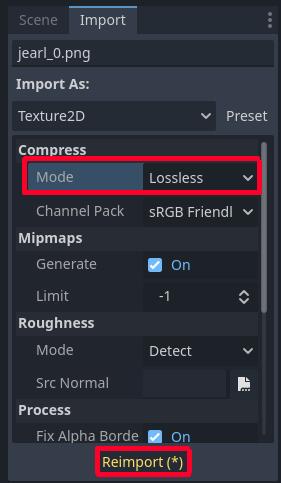

# Making a Game

### Getting the Assets
1. Download the premade assets [here](https://github.com/CSU-WPT/game-dev-workshop/releases/download/godot/assets.zip).
2. Extract the zip file and drag the files into Godot's filesystem, it should now look like this:

- Notice how the gltf files (which contain models) were split into png images, since Godot converts models to scenes which reference the textures externally.
- There is a problem though, Godot automatically compresses imported textures to save space. This is fine most of the time, since most textures are large and single pixels won't make a difference, but these assets use pixel art, which involves small textures where each pixel matters. This causes the model to look wrong. To fix this we can change the import settings of the textures.

### Fixing the Assets

- Select a texture,  go to the "Import" tab, change the "Mode" to "Lossless", then hit "Reimport (*)". Repeat this process for all the textures.

