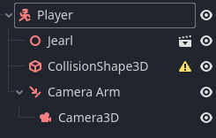

# Making a Player

### Making the Nodes
- Make a handful of new nodes to represent the player. The main one will be a `CharacterBody3D`. Then drag the `jearl.gltf` file to add a model to it. After that, create a `CollisionShape3D` under it, then a `SpringArm3D`, and move the existing `Camera3D` under that. After all of that, the player and its child nodes should look like this.


- Let's rename a few of these nodes, you can do that by double clicking, hitting "F2", or right clicking and selecting "Rename". See the image below:



- Notice there's a caution sign next to the collision shape, that's because you don't have any collision data assigned to it yet. Click on the node, and in the properties editor, click on the `<empty>` in `Shape <empty>`, then select `New BoxShape3D`.


- You should see a transparent blue box appear in the scene, this represents the shape of the collider. Use the orange handles and arrows to properly fit it around the model (you may want to turn off snapping for this).

- Now you have some properties to set on the camera arm. Set the `Shape` to `New SeparationRayShape3D` and the `Spring Length` to `3.0`.


### Scripting the Camera Arm

- In the scene tree, right click the camera arm and select `Attach Script...`


- The default settings are fine, just hit `Create`

- This is the script you're going to use for the camera arm:
```gdscript
extends SpringArm3D

const MOUSE_SENSITIVITY = 0.5
const ZOOM_SPEED = 0.25

const ZOOM_MAX = 5
const ZOOM_MIN = 2

# Called when the node enters the scene tree for the first time.
func _ready() -> void:
	Input.set_mouse_mode(Input.MOUSE_MODE_CAPTURED)

func _input(event: InputEvent) -> void:
	if event is InputEventMouseMotion:
		rotation.y -= (deg_to_rad(event.relative.x) * MOUSE_SENSITIVITY)
		rotation.y = wrapf(rotation.y, 0, TAU)
		rotation.x -= (deg_to_rad(event.relative.y) * MOUSE_SENSITIVITY)
		rotation.x = clamp(rotation.x, -PI/2, PI/20)
	if event.is_action("zoom_in"):
		spring_length -= ZOOM_SPEED
	if event.is_action("zoom_out"):
		spring_length += ZOOM_SPEED
	spring_length = clamp(spring_length, ZOOM_MIN, ZOOM_MAX)

```

### Breaking Down the Camera Script
- The very first line says that this script is made for `SpringArm3D` nodes, think of this like inheritance from Java, it allows you to access all the properties and functions of that class.
- The next few lines declare constants that will be used later.
- The `_ready` function is a special type of function called a "callback". That means Godot will call this function on its own schedule, and you get to create custom behavior for when that happens. This specific function will get called once when the node loads in, which makes it useful for setup and initialization. In this case, it's changing the mouse mode so the cursor dissapears and movement is locked to the window. This is suitable for first person and third person games.
- The `_input` function is another callback that is called whenever the engine sees a player input. It also gives information about the input with the `event` argument. If the event is a mouse motion, then apply that motion to the spring arm's rotation. If it matches one of the zooming events then increase or decrease the spring length. Notice the use of the `clamp` functions, which prevent looking to high or low, and zooming too far in or out.

### Testing the Camera
- Now if you run the game, you can pivot the camera by moving your mouse, and you can zoom in and out. Also when you go low enough, the camera slides across the floor instead of clipping through it. That's the benifit of the `SpringArm3D`. This stops working at very sharp angles, which is why the `clamp` function is in the script.

### Player Movement
- Next, add a script to the player node, it will look like this:

```gdscript
extends CharacterBody3D

enum PlayerState {
	IDLE,
	RUNNING,
	JUMPING,
	FALLING
}

const SPEED = 5.0
const JUMP_VELOCITY = 4.5
const JUMP_BOOST_VELOCITY = 1.5
const ANGULAR_VELOCITY = 5.0

var did_jump_anim = false
var did_fall_anim = true
var current_state = PlayerState.IDLE
var direction = Vector3.ZERO
var gravity = 5
@onready var camera = $"Camera Arm/Camera3D"
@onready var model = $Jearl
@onready var animations = $Jearl/AnimationPlayer

func _process(delta: float) -> void:
	var input_dir = Input.get_vector("walk_left", "walk_right", "walk_forward", "walk_backward")
	direction = (transform.basis * Vector3(input_dir.x, 0, input_dir.y)).normalized()
	direction = direction.rotated(Vector3.UP, camera.global_rotation.y)

	if input_dir:
		model.rotation.y = lerp_angle(model.rotation.y, atan2(-direction.x, -direction.z), ANGULAR_VELOCITY * delta)
	
	if not direction and is_on_floor():
		current_state = PlayerState.IDLE
	elif direction and is_on_floor():
		current_state = PlayerState.RUNNING
	else:
		if velocity.y > 0:
			current_state = PlayerState.JUMPING
		else:
			current_state = PlayerState.FALLING
	update_animation()

func _physics_process(delta: float) -> void:
	if not is_on_floor():
		velocity.y -= gravity * delta

	if Input.is_action_just_pressed("jump") and is_on_floor():
		velocity.y = JUMP_VELOCITY
	
	if Input.is_action_just_released("jump") and velocity.y > 0:
		velocity.y *= 0.25
	
	if direction:
		velocity.x = direction.x * SPEED
		velocity.z = direction.z * SPEED

	else:
		velocity.x = 0
		velocity.z = 0
	move_and_slide()

func update_animation() -> void:
	if is_on_floor():
		did_jump_anim = false
		did_fall_anim = false
	if current_state == PlayerState.RUNNING:
		animations.play("walk")
	if current_state == PlayerState.IDLE:
		animations.play("idle")
	if current_state == PlayerState.JUMPING and not did_jump_anim:
		animations.play("jumping")
		did_jump_anim = true
	if current_state == PlayerState.FALLING and not did_fall_anim:
		animations.play("falling")
		did_fall_anim = true
```