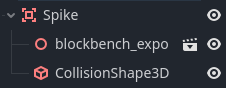
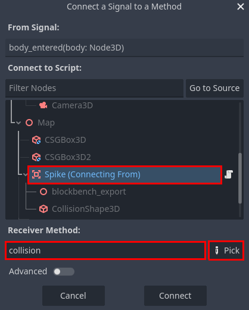

# Making Props

### Creating a Spike
- The first prop to make is a spike. This is a very simple object with a hitbox that resets the scene when the player touches it.
- Create an `Area3D`, drag the `spike.gltf` model onto it, then add a `CollisionShape3D` and fit it to the spike's model. The object should look like this:



- Add this script to it:
```gdscript
extends Area3D

func collision(body: Node3D):
	if body.name == "Player":
		get_tree().call_deferred("reload_current_scene")
```
- The `collision` function gets called whenever something collides with this `Area3D`, then we check the node to make sure it is the player, and if so, we reset the scene. Note the `call_deferred` function. Godot will switch between several major tasks many times every second to create a cohesive experience. That can include rendering, input polling, physics, and more. Certain tasks may have specific requirements while they are running, one example is that the node tree cannot be modified during the physics cycle. Since the `collision` function is called during the physics cycle, and reloading the scene completely destroys and rebuilds the node tree, the physics engine throws an error. Using `call_deferred` tells the engine to wait to call the specified function until it is valid.
- Running the game and walking into the spikes shows that nothing happens. That's because `collision` is not a built-in callback, it's a custom defined function that is called nowhere. In fact, there is no callback for collisions on an `Area3D`. Instead, it has a signal.
- Signals are messages that emit in reaction to specific events. The signal needed here is called `body_entered`. In the top right next to the `Inspector` tab, switch to the `Node` tab and double click the `body_entered` signal. In the pop-up dialog, select the spike node and link it to the `collision` function (the `Pick` button can be helpful here).



- After that, the collision function should be called whenever something collides with the spike, and the logic within it will reset the scene if the collider is the player.
- Finally, click and drag the spike node from the scene tree, and drag it into the file system. Name the file `spike.tscn`. This turns the node into a scene (or the equivelant in Unity, a "prefab"). When the file is dragged back to the scene tree, it creates a copy that is linked to the original. That means that if the `spike.tscn` scene is changed, all existing copies of the spike change to match it. This allows for faster, more modular, and more flexible game development.

### Creating Motor Oil
- The motor oil model will be used for the "win level" object. It is nearly identical to the spike, but changes the scene to a different one instead of resetting it.
- The process will be the same as the spike, with the following differences.
  - Node name will be `Win`
  - Scene name will be `win.tscn`
  - Script will look like this:
```gdscript
extends Area3D

@export var next_level: PackedScene

const SPIN_SPEED = 2

var time = 0
@onready var start_y = position.y

func _process(delta: float) -> void:
	rotate_y(SPIN_SPEED * delta)
	time += wrapf(delta, 0, 2*PI)
	position.y = start_y + sin(2 * time) * 0.125

func collision(body: Node3D):
	if body.name == "Player":
		get_tree().call_deferred("change_scene_to_packed", next_level)
```
- The code in `_process` is to make the prop spin around, and float up and down.
- Notice the line that starts with `@export` at the top. That exposes that variable to the editor, meaning its value can be modified in the properties editor. In this case, another scene can be dragged in, setting the target scene that the player will be sent to after winning. Exported variables are not shared across prefab copies, which means you can have multiple win props in different levels, each which point to different targets.

### Congratulations!
- You've created a basic platformer with lose and win conditions! Play it and take a look at what you made. Experiment with the scripts to see what you can change and how it impacts the game.

### What Now?
- Keep practicing! You can build on the project made from this guide, or you can start a new project. The internet is also full of resources to help you, like [GDQuest](https://www.gdquest.com/tutorial/godot/learning-paths/beginner/), [Godot Game Dev Academy](https://godotdevacademy.com/), and the [Official Godot Docs](https://docs.godotengine.org/en/stable/getting_started/step_by_step/index.html).