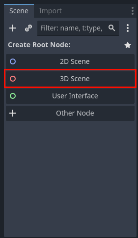
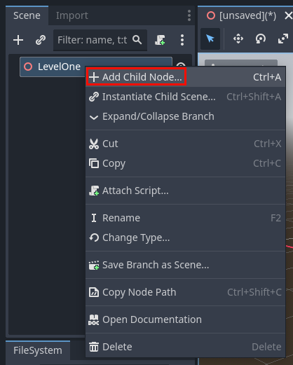
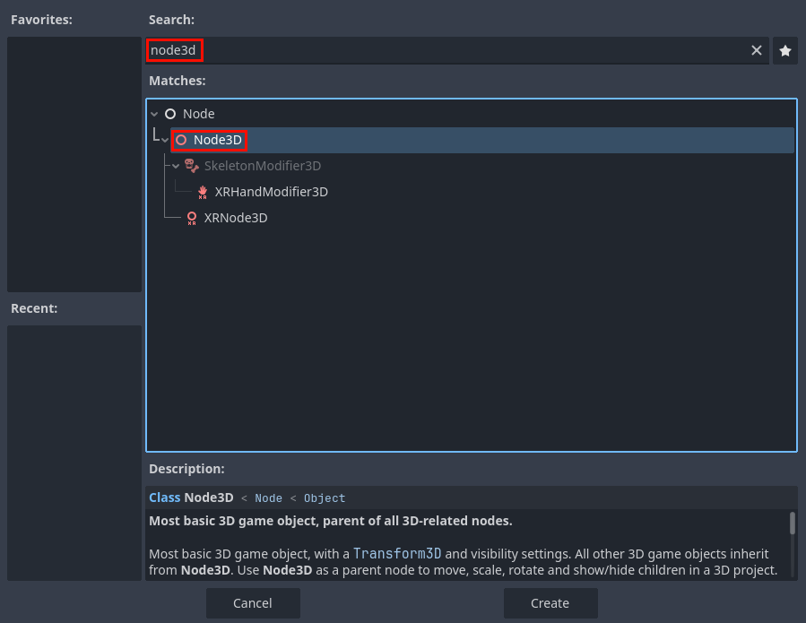
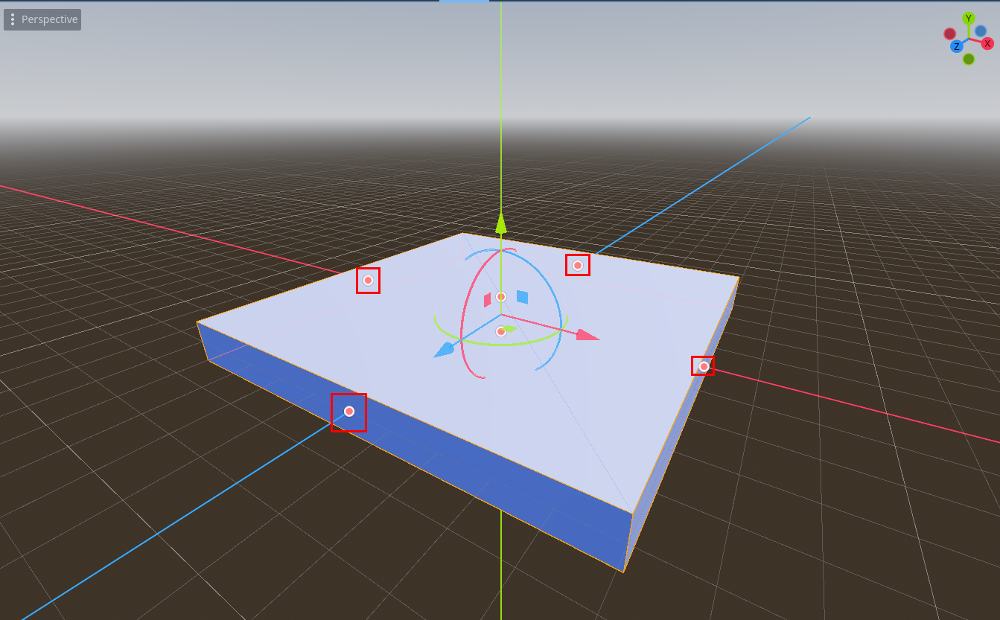
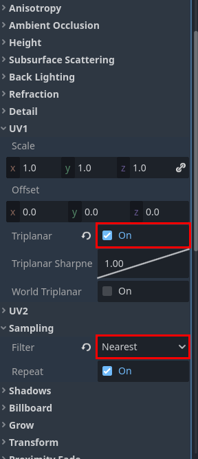
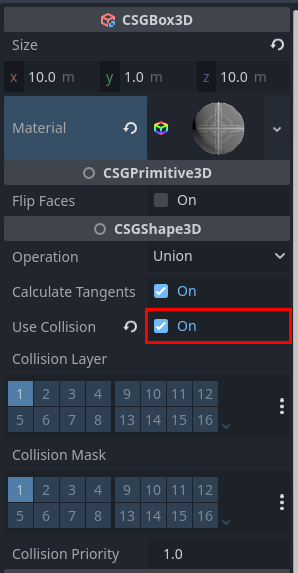
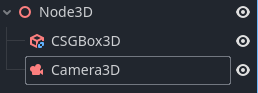
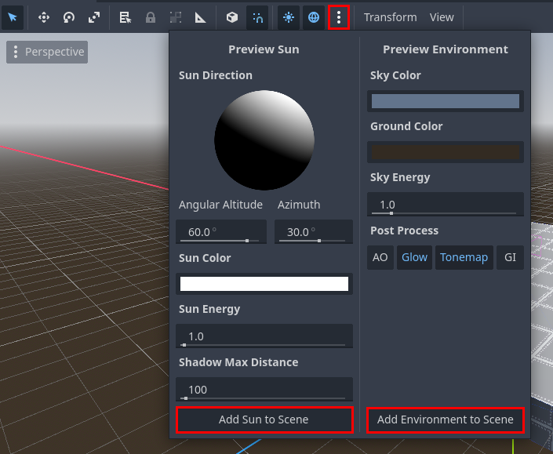
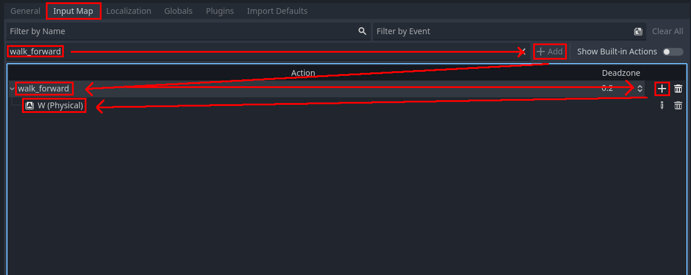
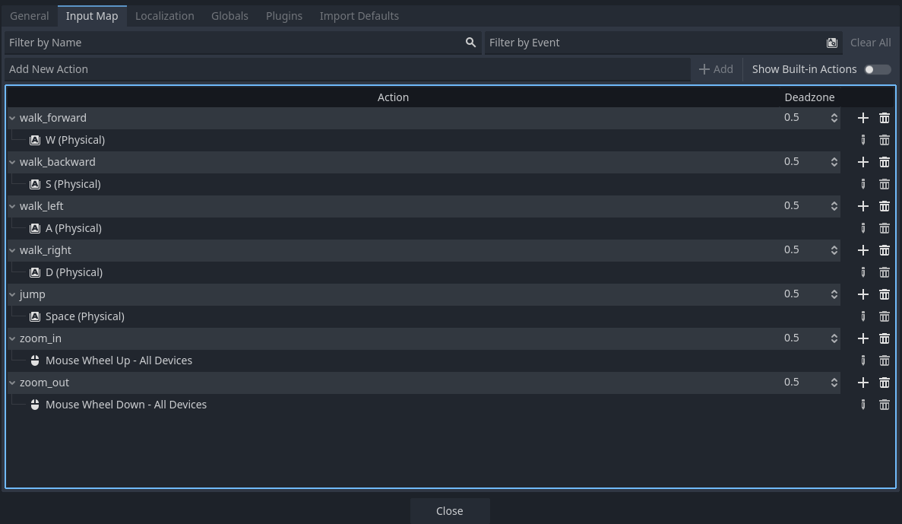

# Setting the Scene

### Creating a 3D Scene
- In the scene tree, click `3D Scene` to create a 3D scene.

- Now you should have a single node in your scene called `Node3D`. This is your root node, it defines that your scene exists in 3D space and everything in it will be a child of this node.
- Double click this node to rename it, and call it `LevelOne`
- Hit "Ctrl+S" to save the scene, and hit enter when the popup appears

### Making the Map
- Right click the `LevelOne` node, and hit `Add Child Node`

- That will create a popup window where you can choose what type of node to create, use the search bar and select another `Node3D`

- Rename this new node to `Map`. Nodes can also be used like folders in a file system for organizational purposes. It doesn't change anything functionally about the scene, but it allows us to organize the different parts of the scene. In this case, this node will contain all the terrain.

- Under the `Map` node, add a `CSGBox3D`. This is a node type that acts as both a rendered mesh, and a collidable box, and a static physics object, whereas normally you would need seperate nodes for these things. The benifit of CSG objects is they allow you to rapidly prototype levels, but they have poor performance when you use enough for a full scale game. Nonetheless, they're perfect for a game jam.

- Now that it's in the scene, click on it, and use the orange handles to resize it. Snapping helps make sure the size is uniform and holding "Alt" while resizing will change both sides at the same time.

### Texturing the Box
- You may also notice there is now a bunch of stuff in the properties editor. Find where it says `Material <empty>` and drag the `tile.png` from the file system in the bottom left onto the `<empty>` text. The box should now have a material assigned to it, and the tile texture should be blurry and streched out across the faces of the box. Let's fix that.

- Click on the new material (it will show up as a sphere in the properties editor), you should see a bunch of subcategories appear. Find `UV1` and enable `Triplanar`. Then find `Sampling` and set `Filter` to `Nearest`.

- Also, outside of the material, you'll need to enable collision.

### Adding A Camera and Sky
- Add a new node, this time it will be a `Camera3D`. This is how the player will see the game world. Once it's in the scene, manually raise it up a bit so it can see the platform. Your hierarchy should look like this now.

- At this point, you can hit the play button in the top right corner and run the game. You'll quickly notice it looks horrendously ugly. That's because there's no sky box or light source. Fortunately, Godot has a builtin menu to add good defaults to our scene. Hit the three dots near the top of the window, and under the submenu, select `Add Sun to Scene` and `Add Enviornment to Scene`. This will add two new nodes to the top of the hierarchy, and if you run the game again, it will look much better.

### Creating the Input Map
- One last thing you need to do before proceeding is to create an Input Map. The Input Map is a piece of data for the project that links certain actions to scriptable inputs. Access this by hitting `Project` in the top left of the window, then choosing `Project Settings`.

- In the `Add New Action` textbox, you type the name of the custom action, then hit `+ Add` to the right. Now the action is in the Input Map. Hit the `+` to the right of it to add a input binding. Typically you can choose what you want just by creating the action (for example hitting a key), but if you can't do that, you can also search up the action name. The sequence for creating one action and binding looks like this:

- These are all the actions and bindings you'll need for this project:

Now that you have a basic scene, let's [make a player!](making-a-player.md)