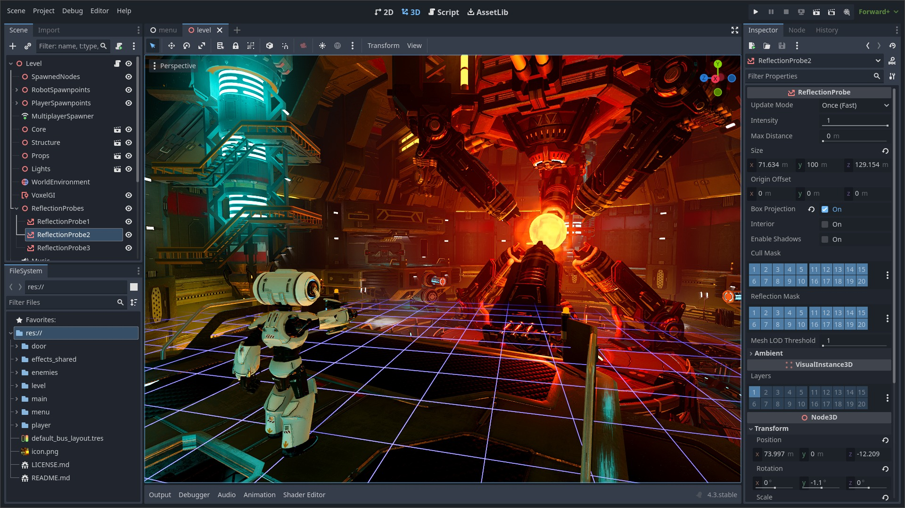

# What is Godot?

Godot is a powerful, lightweight, and beginner friendly game engine that allows people to rapidly create games in GDScript, C#, C++, and many other programming languages. It features a flexible node based scene system, a robust animation system, and a built in physics engine, while offering transparancy and licensing freedom as open source software.

[Let's get Started!](./getting-started.md)
