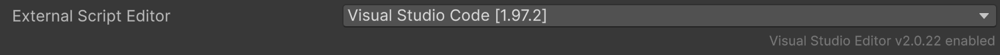

### Let's get Visual Studio Code set up!

1. Download [Visual Studio Code.](https://code.visualstudio.com/download)
2. In VSCode, navigate to the extensions page on the sidebar and download the following extensions:
    - **C# Dev Kit** (by Microsoft)
    - **Unity** (by Microsoft)
3. Next, open your Unity Project and do the following:
    - For *Mac*
        - Go to *Unity* and then click *Settings*
        - In the left sidebar, find and click *External Tools*
        - In the *External Script Editor* sidebar, find Visual Studio Code.
            - If not there, click *Browse...*
            - Go to Applications and find Visual Studio Code then click *Choose*
        - Close out of *Settings*
    - For *Windows*
        - Go to *Edit* (up top), click it, and then find and click *Preferences*
        - On the left sidebar, find and click *External Tools*.
        - In the *External Script Editor*, find Visual Studio Code.
            - If not there, click *Browse...*
            - In File Explorer, on the top right, search for the Visual Studio code **.exe** file (the actual application itself)
            - Double click it.

4. Upon returning to the Unity Editor, inside the dropdown bar, you should see something like this:
    
