#### Let's set up some animations!

#### To start, let's set up an **animator** for our object!

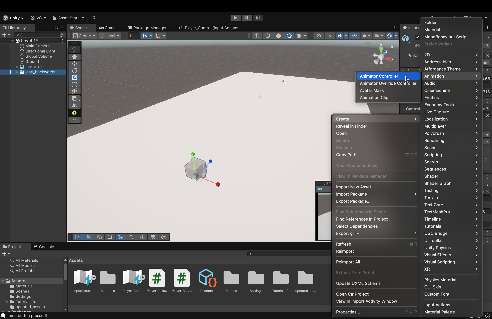

1. In our *Assets* view, right-click then hover over *Create*. In the next menu, hover over the *Animation* menu. Then, in the next menu, click on **Animator Controller**.
    - Be sure to name it something like "Player_Animate"
    - What is this and why do we need it?
        - The **Animator Controller** is an asset in Unity that handles the logic of which animations will play for a particular object, what the transitions are, when the transitions occur, and so on.
        - However, for this tutorial, we will NOT be using it in the traditional sense.
            - Instead, we will transition between the animations using **code**.
                - In my recent experience in learning Unity, this was much easier to understand (for me, at least).
                - In addition, the Animator Controller gets significantly more complicated as more animations are added and configured.
 

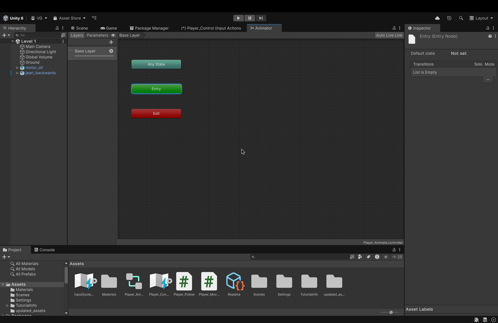

2. Double click on the newly created Animator Controller below in your *Assets*. You will see the window (in the image above) open up.
    - When gameplay is initiated, the first node, the first animation that we place (which will act as a **node** on a **graph**) will connect to the *Start* node.
        - This animation will play **first** upon initiating gameplay.
    - From here on out, even though we won't make explicit node connections, we will still place all of our animations here (starting with **idle** animation first).
 

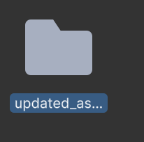

3. To access our animations, double-click on the *updated_assets* folder.
 

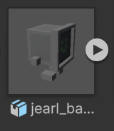

4. Find the *jearl_backwards* asset and click the **triangle** icon to expand the "innards" of the asset
 

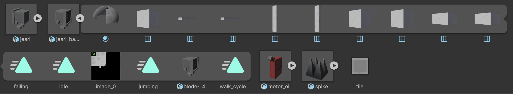

5. This is what you should see when you expand the asset. Here, our animations are items that are marked with a **teal triangle with lines on the left**. These are our animations.
    - Be sure to thank **David Awkar** for creating and providing the assets and the animations (🎉).
 

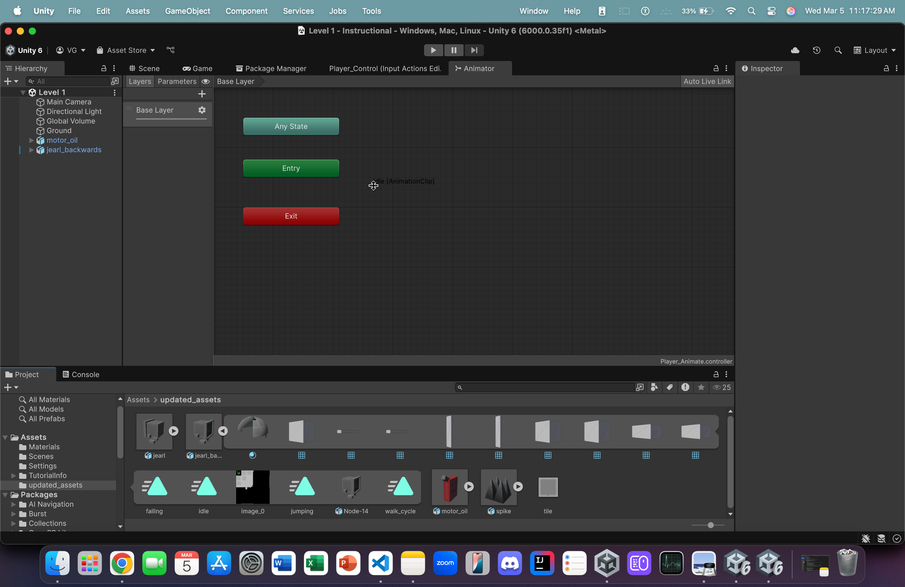

6. Drag and drop the *idle* animation into the *Animator Board*. 
    - This is our first animation that will play.
        - By convention, in any game, the idle animation is always placed first.
 

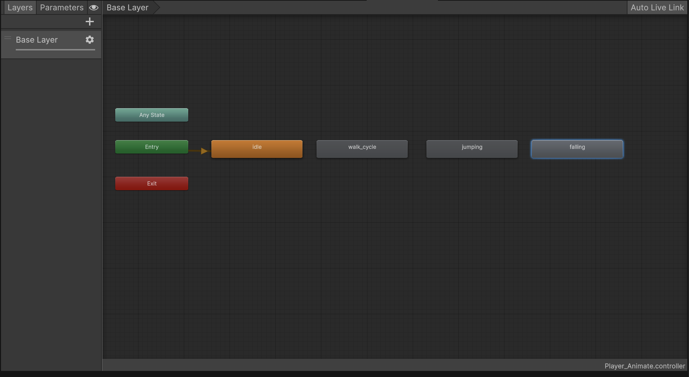

7. From here on out, place all the rest of the animations onto the board.
    - For our case, the order doesn't matter (except for the *idle* animation going first)
    - This is because we'll be using code to switch in between the animations. Therefore, placement order doesn't matter.
 

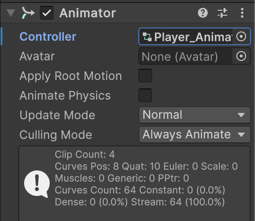

8. Back in the Scene view, click on *jearl_backwards* and, in the Animator component, drag and drop our Animator Controller object into the *Controller* box
    - Unity will have auto-created an Animator Controller when you placed the *jearl_backwards* asset into the Scene.
 

#### Now, let's add the code to switch between animations!
 

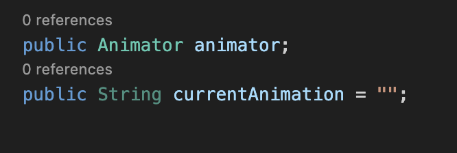

9. In our *Player_Movement* script, let's add the following variables:
    - *public Animator animator;*
        - This is what will hold our Animator Controller that we made earlier. Any changes we make to our animations will be made to this variable.
    - *public String currentAnimation = "";*
        - When transitioning between our animations, we will simply use the **name** of the animation (as it is inside our Animator Controller).
        - This variable will simply hold that name as a String.
 

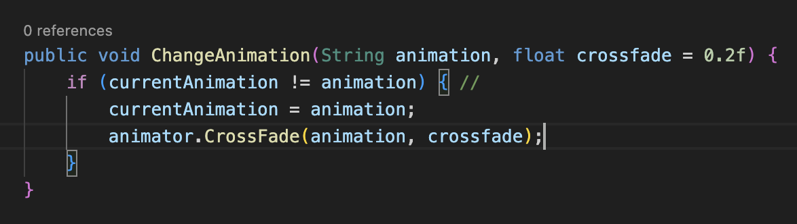

10. Now, let's add the following function to our script, right below *OnCollisionEnter*
    - What is this? What does it do?
        - This function is what will actually initiate the transition between our animations.
        - It takes in two parameters:
            - animation
                - This is the **name** of the animation to transition to.
            - crossfade
                - This is the length (in seconds) over which we will transition between two animations.
        - Let's go over each line:
            - *if (currentAnimation != animation) {*
                - If the current animation is **NOT** the new animation which we wish to transition to.
                - This if statement ensures that we skip the body of the function *if* *animation* ever equals *currentAnimation*.
            - *currentAnimation = animation*
                - If the transition is a valid transition, then we take the name of the current animation and set it to the name of the new animation.
                    - Essentially, that String variable keeps track of the animation that is currently playing.
            - *animator.CrossFade(animation, crossfade)*
                - This is the line performing the transitions.
                - Since our *animator* variable is of type *Animator*, we can call the built-in function **CrossFade** on that variable (which, remember, is going to hold our Animator Controller) to switch from one animation to another.
                    - The first parameter is the **name** of the animation to transition to.
                    - The second parameter is the fade length in seconds.
    - We will now call this function in a variety of situations.
 

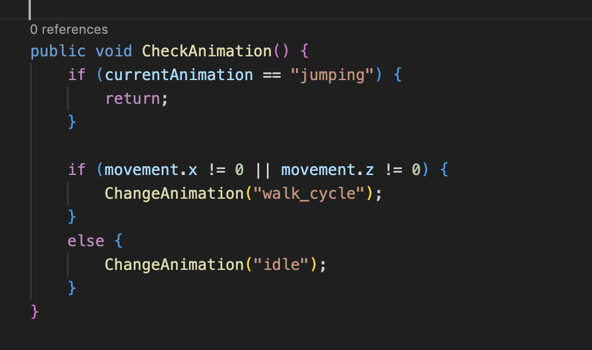

11. Next, below our *ChangeAnimation* function, let's add this function.
    - What does it do?
        - This function will run every frame (alongside *movePlayer*) to constantly change the player object's animation during gameplay.
    - Let's go through each line:
        - *if (currentAnimation == "jumping") { return; }*
            - If our current animation is the jumping animation, **DON'T DO ANYTHING**.
            - We don't want to make animation transitions while we're airborne. Hence, we use this line to ensure that that doesn't happen.
        - *if (movement.x != 0 || movement.z != 0) { ChangeAnimation("walk_cycle"); }*
            - If we're moving, at all, in any direction, then change the animation to *walk_cycle*.
            - Recall that our *movement* variable is a 3D vector whose **only** changing values are for the x-axis and z-axis (we don't move upwards, along the y-axis, with WASD).
                - So, we check these two. See if one is non-zero, the other is non-zero, or both are non-zero. If any one of these conditions is true, we change the animation to the walking animation.
        - *else { ChangeAnimation("idle"); }*
            - If we aren't moving at all, change the animation to *idle*. Pretty-self explanatory.
 

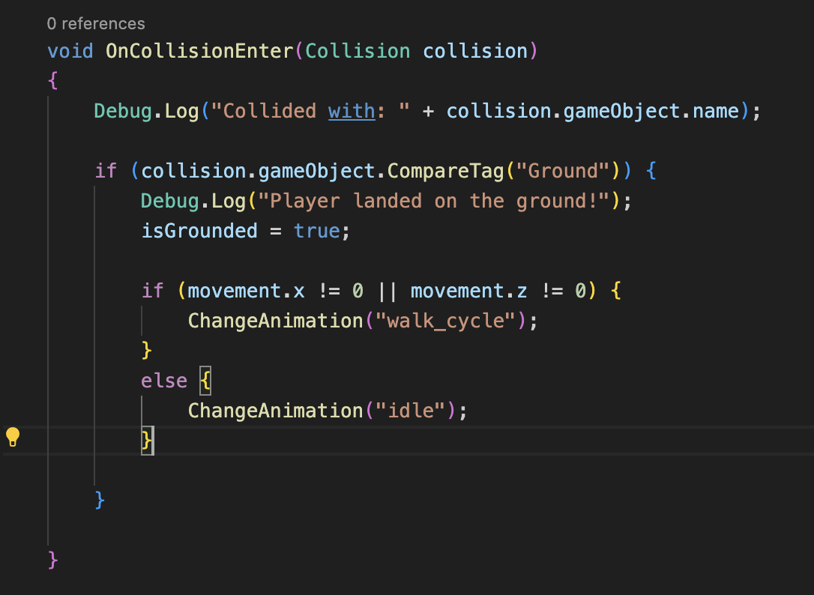

12. Copy the if-else statement from our *CheckAnimation* function (which checks for movement) and paste it in the *OnCollisionEnter* function, inside the if statement that checks for a collision with *ground*
    - Why do we need this here?
        - Without this check here, after jumping (and initiating the jump animation), we will be permanently stuck in the jump animation. 
 

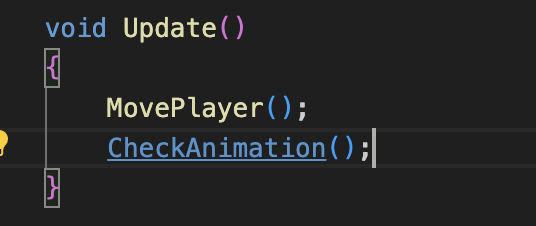

13. Lastly, add a function call for the *CheckAnimation()* function in the *Update()* function.
    - We need this function to run every frame so that our animation changes dynamically and **constantly**.
 

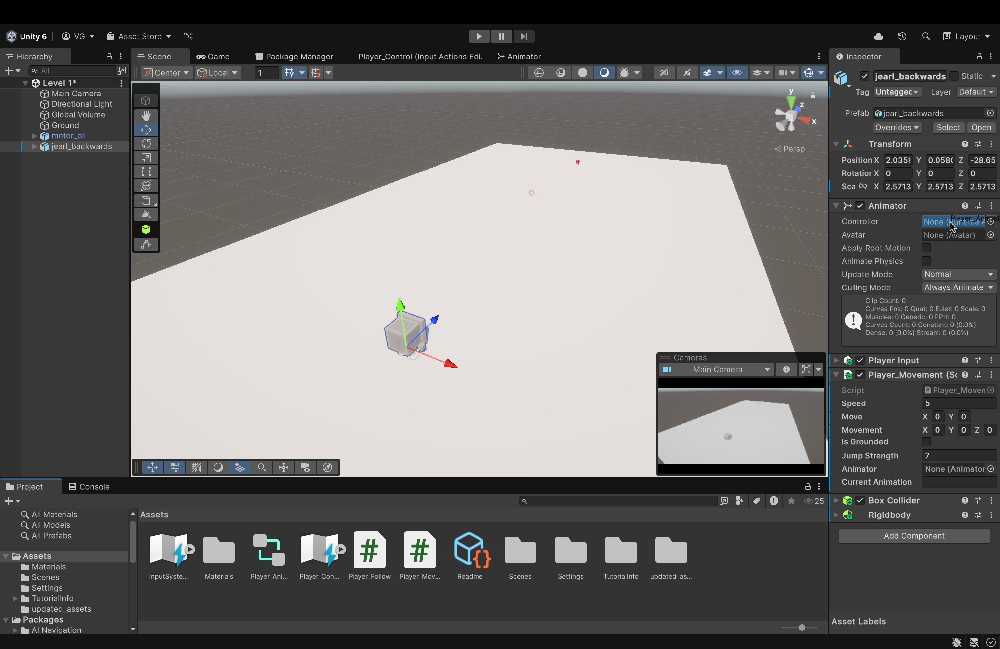

14. Back in our editor, drag and drop the Animator Controller object we created into the blank space in the Animator component of *jearl_backwards* in our **Script** component.
 

#### One last note --> add a ChangeAnimation() call for the "jumping" animation inside of our isGrounded (if (isGrounded) {...}) check in "OnJump"

 

#### Now, with the changes made, upon running our game, you should see animations for movement, idling, jumping and falling

