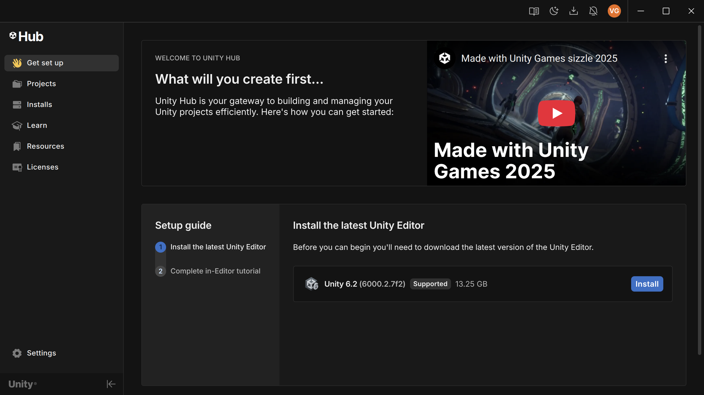
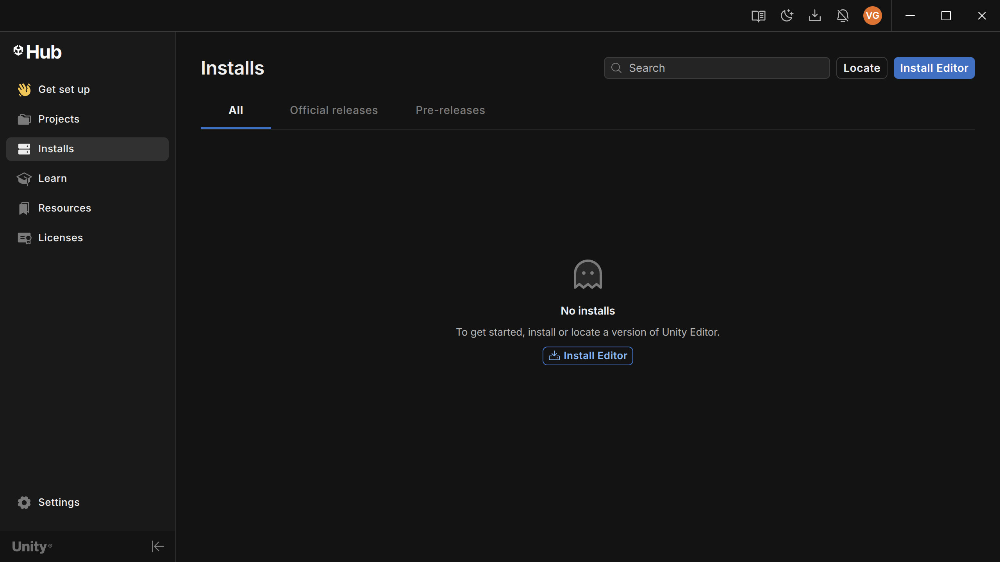
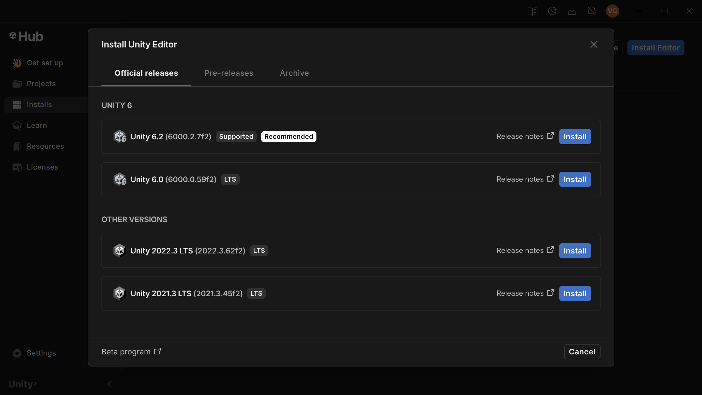

# Getting Started

### Downloading Unity

1. Go to [unity.com/download](https://unity.com/download)
2. Click "Dowload" at the top to download the installer for Unity Hub.
3. Follow the installer's instructions to download the Unity Hub.
4. Once finished, the Hub should launch automatically and prompt you to download the Unity Editor. Please do so.
- Caution: This is a **LARGE** installation. Ensure you have ample storage space before proceeding.

**For Linux:**
1. Navigate to [this link.](https://docs.unity3d.com/hub/manual/InstallHub.html)
    - I recommend using the terminal commands that are provided on the page to install Unity Hub.
    
2. Similar to the Windows/Mac installation, once opened, the Hub will automatically prompt you to install the Editor (if you haven't already).

    - Should look something like this:
    

    - If there isn't one, navigate to *Install* section and click *Install Editor*:
    

    - Next, select the ***LTS (Long-Term Support)*** version.
        

        - As the name suggests, this version will be more reliable in the long-run.

**FOR <u>ALL</u> INSTALLS:**

- When prompted to select which modules to add, select **WebGL Support**.
- Exporting the game's playable executable to the web is how groups are expected to present their games during the final evaluations.

 

### Creating a new project
1. Once Unity Hub is installed, navigate to the "Projects" sidebar
2. Click "New Project"
3. In the sidebar, click "All templates".
4. We will be using the "Universal 3D" template
5. On the side, give your project a name and place it in your desired directory. 
6. Click "Create project" and it will create and launch the editor automatically.
 
- This is what it looks like... 

 

[Now, we get to the fun stuff!](./unity_scene_setup.md)