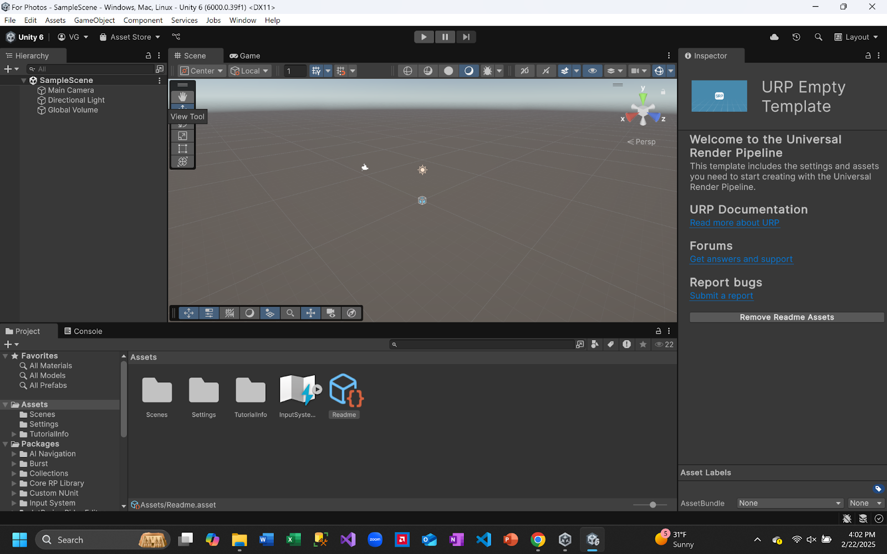

# Getting Started

### Downloading Unity

1. Go to [unity.com/download](https://unity.com/download)
2. Click "Dowload" at the top to download the installer for Unity Hub.
3. Follow the installer's instructions to download the Unity Hub.
4. Once finished, the Hub should launch automatically and prompt you to download the Unity Editor. Please do so.
- Caution: This is a **LARGE** installation. Ensure you have ample storage space before proceeding.

### Creating a new project
1. Once Unity Hub is installed, navigate to the "Projects" sidebar
2. Click "New Project"
3. In the sidebar, click "All templates".
4. We will be using the "Universal 3D" template
5. On the side, give your project a name and place it in your desired directory. 
6. Click "Create project" and it will create and launch the editor automatically.
 
- This is what it looks like... 

[Now, we get to the fun stuff!](./unity_scene_setup.md)