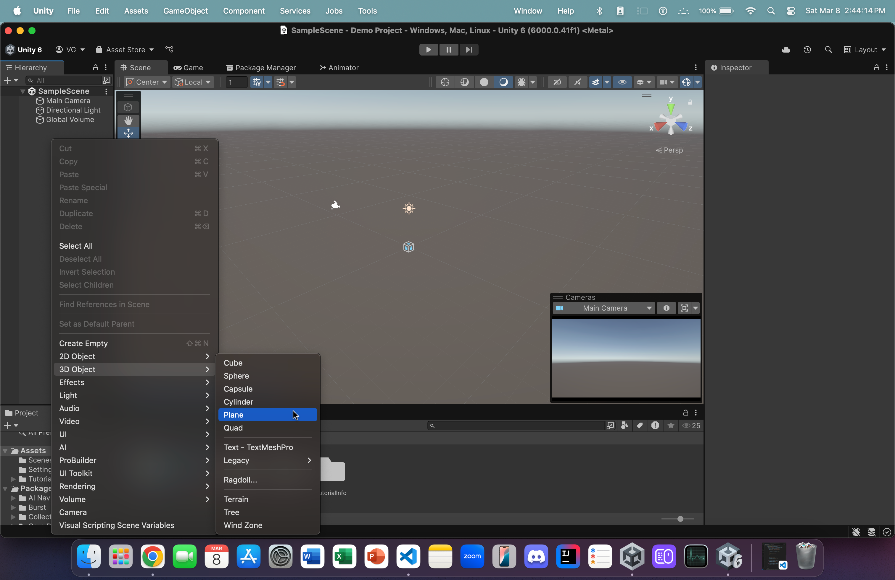
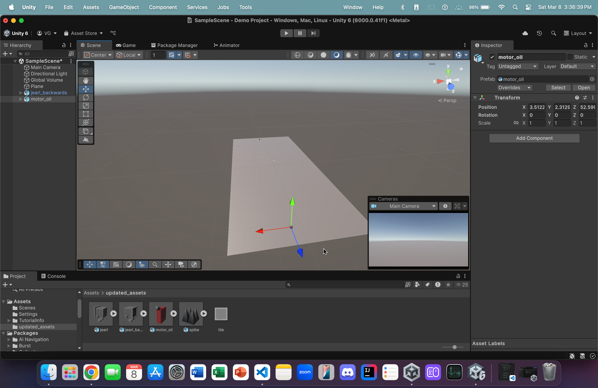

## Adding a ground object

Let's start by adding a ground object:

1. Right-click in the Scene Panel on the left.
 

2. Hover over **3D Object**.
 

2. Click on **Plane** to create a plane.
 

3. Double click on the newly created plane object in the **scene panel** (on the left) to zoom in on it in the Scene View (in the center). 
    - On the right, in the component panel, inside the *Transform* section, change the *Scale's* **x-component** and **z-component** to 5 and 12, respectively. In addition, set all components of *Position* and *Rotation* (inside *Transform*) to 0.
    - Also, ensure that your axes are aligned the same way that they are in the image above. 
        - The z-axis (in **blue**) should be pointing away, diagonally.
 

4. From within the *updated_assets* folder, click and drag **jearl_backwards** onto the ground object (which is the plane we created earlier).  
 

4. Repeat step 4 but, this time, drag and drop the *motor_oil* asset onto the ground 
    - Be sure to place it somewhat far away near the **opposite** end of the plane (away from *jearl_backwards*)
 

4. Another tip:
    - In the Scene View, up top, **right-click** on the Scene tab.
    - Click on **Overlay Menu**
    - In the list, click on **Cameras**
        - This will toggle a preview window for the camera in this game
        - We'll only ever have one camera. Therefore, this is handy for seeing the POV of your camera (i.e. what its looking at)
 
#### This concludes our scene setup (for now). We will now proceed to the [input configuration](input_config.md)