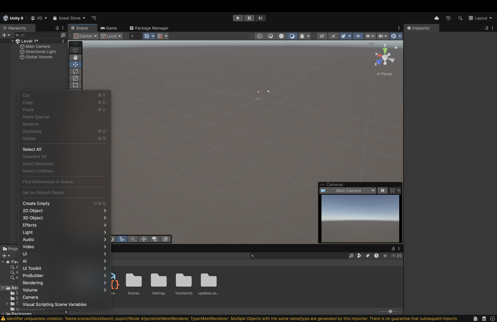
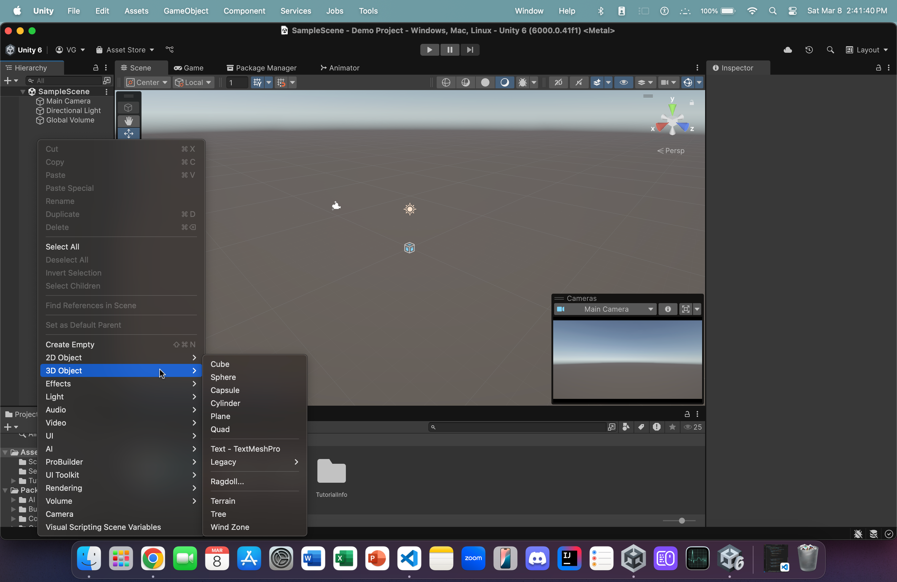
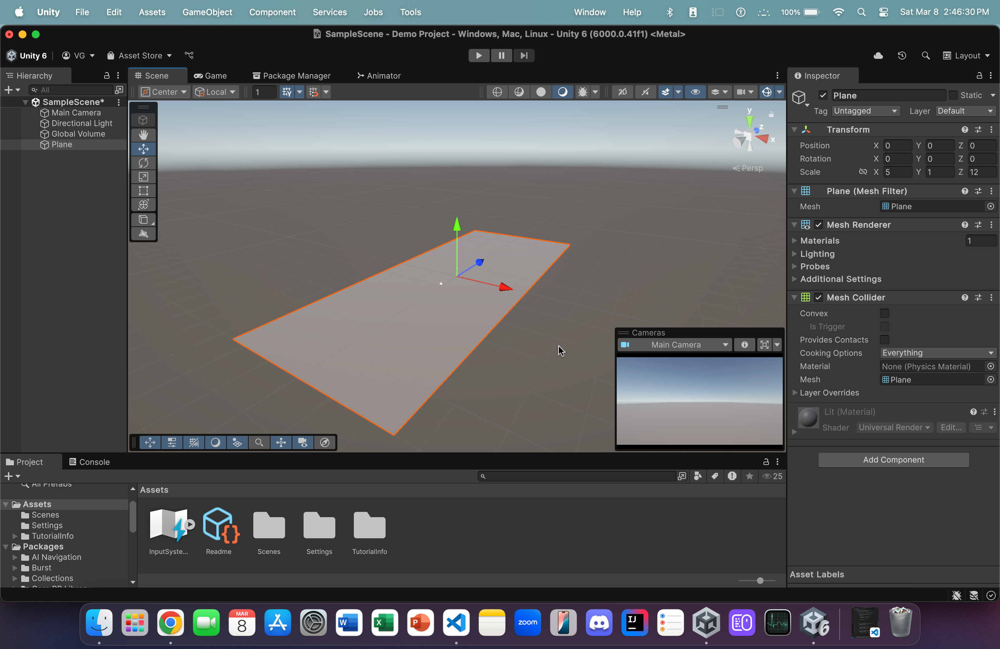
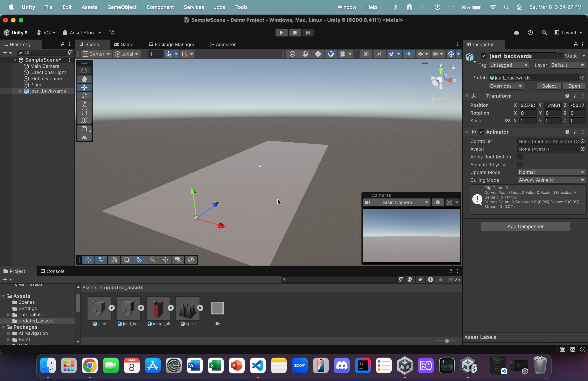

## Adding a ground object

Let's start by adding a ground object:

1. Right-click in the Scene Panel on the left
 

2. Click on *Cube* to create a cube object
 

3. Double click on the newly created cube object in the scene panel to zoom in on it in the Scene View. 
    - In the component panel, change the scale's x-component and z-component to 50 and 85, respectively. In addition, change all components of transformation to 0. 
 

4. From within the *updated_assets*, click and drag **jearl_backwards** onto the ground object.  
 
