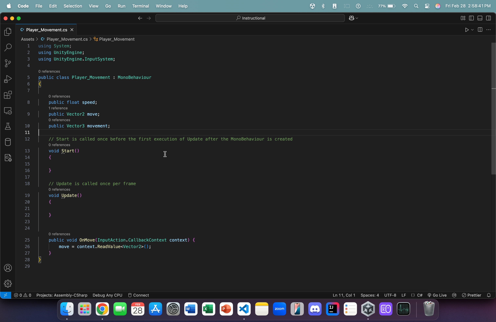
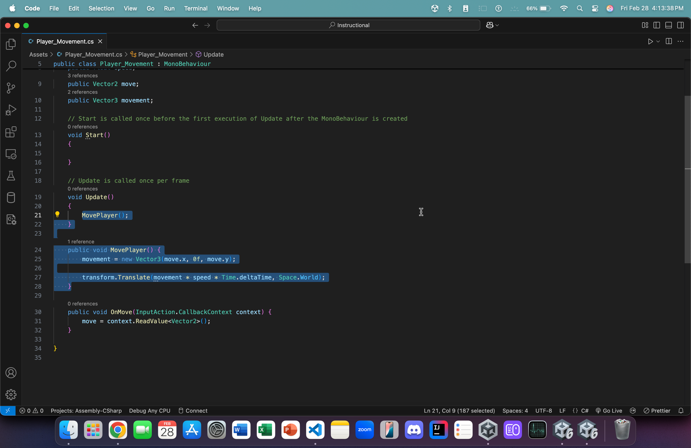

### Input Configuration

- For this tutorial, we will be using the new Unity Input system.
- Those w/ prior Unity experience may still know how inputs were taken from the user before the addition of the new system (done mostly within code)

 

- However, with the new system, we can easily configure different actions for our player asset with custom made action maps and key bindings (you can even configure controllers!)

##### Let's get started!

 

1. Navigate out of the assets folder (if you're following along from the previous page).
 

2. Right-click, hover over *Create* and scroll down until you see *Input Actions*. Click it to create a new Input Actions Asset. 
    - I named mine "Player_Control" but you can name it whatever you want.

3. On the right, click *Assign as the Project-wide Input Actions*. This ensures that our inputs stay consistent and that we don't run into any unexpected errors.

4. On the right, click *Assign as the Project-wide Input Actions*. This ensures that our inputs stay consistent and that we don't run into any unexpected errors.

 

Now, double-click to open it in a separate window and dock it next to the *Scene* and *Game* view.

 

5. On the left, create a new action map called *Player* by clicking the plus icon

    - An action map is essentially a container that holds bindings (either for a keyboard or for a controller). Once established, this action map (and its associated bindings) can be assigned to whatever asset we want (like **jearl_backwards**).
 

6. On the right panel, change the action type to **Value**. 
    - The reason is because, conventionally, movement in games is always done by pressing and holding a button (i.e. it generates a *continuous* value like "WWWWWWWWW..." for forward movement) unlike jumping, for example, where we press once and don't hold.
    - The game engine (and our script) will read that continuous string of W's, interpret it to mean forward movement and, consequently, move our player forward so long as it keeps getting those continuous W's.
        - It's not exactly like this but hopefully you get the idea 😁
 

7. In the additional dropdown menu that is spawned underneath *Action Type*, change *Control Type* to **Vector 2**.

    - This is because our movement is only in 2 directions (the x-axis and the z-axis). This is unlike Creative Mode in Minecraft, for example, where we can freely move in any direction.
        - We will move in the y-axis (via jumping) but **not** with continuous movement.
 

8. Find the plus icon next to *Movement* (in the center panel). Click it and then, in the dropdown menu, click *Add Up/Down/Left/Right Composite*
    - This will automatically create placeholders for 4 movement bindings (WASD) and bind/aggregate them into a single Vector 2 vector. 
        - I haven't tried it but you could try manually creating each key binding (without the composite). However, you will have to aggregate them yourself in your script. 
        - Using the composite, therefore, will result in less headaches and a cleaner setup.
 

9. Expand the newly created *2D Vector* dropdown to show the 4 empty bindings. 
    - Now, for each binding: 
        - Click on it in the center panel
        - On the right, open the *Path* dropdown.
        - Here, either search for the key to bind or click the *Listen* button and press the key you'd wish to bind and it will pop up in the dropdown below. 
        - Click your desired key to attach it to the *Up* binding.
        - Repeat for all 4 bindings. 
 

10. Up top, in the right corner, click *Save Asset* to save changes.
 

 

10. Let's navigate back to the Scene View.
    - Click on **jearl_backwards** in the scene view itself (or in the scene panel on the right)
    - In the component panel on the right, we will add a **Player Input** component to attach our newly made action map and key bindings to our player asset
        - In the search bar, start typing **Player Input** and you'll see it below.
        - Click it to add it to the **jearl_backwards** asset.
    - Notice that Unity will automatically assign our custom-made Input Actions asset here.
        - The *Actions* attribute will be the *Player_Control* Input Actions asset (which, you can see, is visible below in our assets folder)
        - The *Default Map* attribute will be the *Player* binding map (which we just made).
 

#### Now, it's time to put all this together in a C# script.

 

#### But, now we need to set up our code editors.

- For my Mac folks, we are gonna have to use [**Visual Studio Code**](./IDE_setup/VSCode.md).
- For my Windows folks, you guys are free to choose between VS Code and [**Visual Studio**](./IDE_setup/Visual_Studio.md) (the purple one). 

#### For this tutorial, as a Mac user, I will use VS Code. But, you guys are free to use whatever is most convenient for you. 

 

11. Click on **jearl_backwards**
    - In its component panel, at the bottom, click *Add Component*
    - In the search bar, start typing *New Script* 
        - You should see the option shown in the image above.

 

12. Name the script something like *Player_Movement*. Then, click Create and Add. This will create the script and add it as a component to this object (jearl_backwards)

 

#### Now, when you double-click the script (inside the script component), assuming you set up your respective IDE correctly, it should automatically open the script in said IDE. For me, in VSCode, it looks something like this:

#### Let's write some code to allow player movement!

13. In the Update function, type *MovePlayer()* (we'll define this function later).
    - This function, as per the description of the Update() function, will run every single frame of the gameplay (which is what we want)

12. Add three variables before Start() but inside our main method:
    - *public float speed*
        - This will dictate, well, the speed of our movement (we will be able to set the value of this variable inside our editor before hitting the play button as it is **public**)
    - *public Vector2 move*
        - If you remember from earlier, our movement (inside our action map) is strictly in 2 directions (that's what we want). We limited our key bindings to Vector2. 
        - Thus, when we read our player's movements, they will be in a **2D vector** and will be placed inside an onject of type **Vector2**
    - *public Vector3 movement*
        - Since our game world is a **3D space**, we need to translate our 2-dimensional movement into a 3D vector w/ the y-axis (straight up) set to 0.
            - Bonus question: why would we set the y-axis to 0 in our 3D vector?

 

13. Add the following function after *Update()*:

    - public void OnMove(InputAction.CallbackContext context) {
        move = context.ReadValue< Vector 2 >();
    }
     
    - Imagine your player asset is a toy remote car:
        - Your keyboard/controller is the remote
        - Unity's Input System is the "messenger"
        - The function *OnMove* is the car receiving the message
        - The *CallbackContext* is the message itself (the message that you send to the function upon a button press)
            - The message says what you (the person controlling the car) want the car to do.
                - Move? Move where? How fast? Is this gonna happen once or continuously?
        - In this case, the message is a 2D Vector indicating which direction you're moving in.
         

        - Consider the following example:
            - In a 2D space like the one below:
            
            - (0,1) would mean "move in the +y axis" (i.e. upward)
            - But now, when we translate this 2 dimensional movement into a 3 dimensional world, we have to be careful.
                - The y-axis is now upwards (directly upwards). The newly added z-axis is the new "forward" axis. And x is still for left/right movement.
            - So, when we map (0,1) from 2D to 3D, we would have to assign it in some way like this (assume our 2D vector is called "move", like above, and our 3D vector is still "movement"):
                - movement = new Vector3(move.x, 0f, move.y);
            - Why?
                - Like I said earlier, we don't move upwards with WASD. We only move along the x and z axes.
                - Since our 2D vector is (0,1), our 3D translation of this 2D vector **(0, 0f, 1)**. Which means that we are now moving (in the 3D space) **1 unit in the positive z-axis (AKA forward)**
                - Now, since this action is repeated every frame, in 60 fps gameplay, our character will have smooth forward movement.

#### This is the perfect segue to our next addition to this script!

 

14. We now add a new function which we place inside of *Update()* (so that it is called every frame). Inside of that function:
    - We placed the *movement = new Vector3(move.x, 0f, move.y)* line
    - We also placed a new line:
        *tranform.Translate(movement * speed * Time.deltaTime, Space.World);
    - What does this mean?
        - *transform* 
            - Refers to this game object (the one that this script is attached to)
        - *.Translate* 
            - Allows us to move the object from its current position.
        - *movement * speed * time.DeltaTime*
            - We multiply our speed value by our movement vector (so that we're not at a speed of 1 unit per frame)
            - *time.deltaTime* 
                - What is that?
                - This allows our player movement to be **frame-independent**
                    - Imagine that your computer runs the game at 60 fps (frames per second)
                    - We can calculate the total # of units moved by the player by doing:
                        - 60 * 5 (our speed, let's say) * movement ([0, 0, 1], let's say)
                        - Thus, we moved **300 units** in total
                    - Let's assume your buddy's PC runs at 120 fps
                        - Then, by the same calculation (with the same movement), I moved **600 units** in total when I run the game on his PC.
                            - That's not good! This means that the higher the FPS is, the faster we move.
                    - This is why we multiply this expression by **time.deltaTime** (whose value is roughly equal to 1/your fps amount). 
                        - 60 * 1/60 = 1 & 120 * 1/120 = 1. Therefore, our overall movement stays **consistent** across different machines (since we're just multiplying by 1). 
        - *Space.World*
            - This allows our player object to move relative to the **game world's global axes.**
            - This means that, regardless of where I am or what direction I'm facing or what orientation the camera's in, when I press W, I will always move in the positive z-axis.
            

 

#### Now, let's go back to the Unity Editor.

 

15. Now, when you press the play button up top, you should be able to move around (make sure your speed value is not 0)

#### Fatal error (this is me from a couple minutes in the future). I just realized that I placed down the assets in the wrong way. If you've been following this tutorial, when you ran the game, your player is likely moving in the complete opposite directions.

#### Fix: Swap your jerry can and jearl_backwards assets' positions and also turn the camera so it is properly oriented and centered on our player. And it should work. 

 

#### You'll notice that the player is "stiff". He's always looking in the same direction. Let's change that so that the player looks in the direction that we're moving in!

16. Back in our script, add the following line: 
    - *transform.rotation = Quaternion.Slerp(transform.rotation, Quaternion.LookRotation(movement), 0.1f);*
    - What does this mean?:
        - *transform.rotation*
            - Now, we're accessing this game object's rotation characteristic (before, it was translation)
        - *Quaternion.Slerp(...)*
            - In mathematics, **Quaternions** are objects that are used to represent rotations in a 3D space
            - The function *.Slerp()* takes two such quaternions and interpolates (or transitions) between them with a given strength (indicated by a floating-point number).
        - *(transform.rotation, Quaternion.LookRotation(movement), 0.15f)*
            - Here, our two quaternions are:
                - *transform.rotation*
                    - This object's current rotation
                - *Quaternion.LookRotation(movement)*
                    - The rotation required to face in the direction of the given 3D vector (we used the Quaternion class's built-in function, LookRotation, to achieve this)
                - *0.1f*
                    - We transition between these two rotations with a strength of 0.1 (which is slow enough to see the transition)
                        - Our game object will smoothly transition between rotations (instead of snapping) when we press WASD.

#### Now, when you go back to the Editor, let the new script update, and hit Play, you should see movement and the player object rotate (i.e. look) in the direction of movement. Isn't that cool?
                
    

