### Input Configuration

- For this tutorial, we will be using the new Unity Input system.
- Those w/ prior Unity experience may still know how inputs were taken from the user before the addition of the new system (done mostly within code)

- However, with the new system, we can easily configure different actions for our player asset with custom made action maps and key bindings (you can even configure controllers!)

##### Quick disclaimer:

- Unity, as part of the new input system, provides an auto-generated input actions asset called **InputSystem_Actions.inputactions**.
- This comes with a lot of presets already assigned for character movement and UI navigation.
- If you prefer to use it, then skip to step 10. Otherwise, continue onward.

##### Let's get started!

 

1. Navigate out of the **updated_assets** folder (if you're following along from the previous page) into the **Assets** folder.
 

2. In the Assets folder in the File View below, right-click, hover over *Create* and find the **Input Actions** option. Click it to create a new Input Actions Asset. 
    - Unity will prompt you to enter a new name for it.
    - I named mine "Player_Control" but you can name it whatever you want. Henceforth, I will refer to it using this name

3. On the right, in the Component Panel, click **Assign as the Project-wide Input Actions**. This ensures that our inputs stay consistent and that we don't run into any unexpected errors.

 

Now, double-click **Player_Control** to open it in a separate window and dock it next to the *Scene* and *Game* view.

 

4. On the left, in the **Action Maps** panel, create a new action map called **Player** by clicking the plus icon in the top right corner of the panel.
    - Name it **Player**

    - An action map is essentially a container that holds bindings (either for a keyboard or for a controller). Once established, this action map (and its associated bindings) can be assigned to whatever asset we want (like **jearl_backwards**).
 

5. On the rightmost panel (called **Action Properties**), change the action type to **Value**. 
    - The reason is because, conventionally, movement in games is always done by pressing and holding a button (i.e. it generates a *continuous* value like "WWWWWWWWW..." for forward movement) unlike jumping, for example, where we press once and don't hold.
    - The game engine (and our script) will read that continuous string of W's, interpret it to mean forward movement and, consequently, move our player forward so long as it keeps getting those continuous W's.
        - It's not exactly like this but hopefully you get the idea 😁
 

6. In the additional dropdown menu that is spawned underneath *Action Type* (called **Control Type**), change its value to **Vector 2**.

    - This is because our **movement** is only in 2 directions (the x-axis and the z-axis). This is unlike Creative Mode in Minecraft, for example, where we can freely move in any direction.
        - We will move in the y-axis (via jumping) but **not** with continuous movement.
 

7. In the center panel (called **Actions**), where it says *New Action*, rename it to **Movement**.
    - Then, click the small **plus** icon next to Movement (all the way on the right)
    - In the menu that pops up, click **Add Up\Down\Left\Right Composite**.
        - If an additional item called **No Binding** is created, delete it.
    - This will automatically create placeholders for 4 movement bindings (for, say, W-A-S-D) and bind/aggregate them into a single 2D vector. 
        - I haven't tried this yet but you could try manually creating each key binding (without creating the composite). However, you will have to aggregate them yourself in a C# script. 
        - Using the composite, therefore, will result in less headaches and a cleaner setup.
 

8. Expand the dropdown menu of the newly created *2D Vector* to show the 4 empty bindings. 
    - Now, for each binding: 
        - Click on it in the center panel
        - On the right, open the *Path* dropdown.
        - Here, either search for the key to attach to this binding **or** click the *Listen* button and press the key you'd wish to attach and it will pop up in the dropdown below. 
        - Click your desired key to attach it to the *Up* binding.
        - Repeat for all 4 bindings. 
 

9. Up top, in the right corner, click *Save Asset* to save changes.
 

 

10. Click on the **Scene** tab to navigate back to the Scene View.
    - Click on **jearl_backwards** in the Scene View itself (or in the Scene Pane on the left)
    - In its component panel (on the right), we will add a **Player Input** component to attach our newly made action map and key bindings to our player asset.
        - In the component panel, clikc **Add Component** (usually at the bottom)
        - In the search bar, start typing **Player Input** and you'll see it below.
        - Click it to add it to the **jearl_backwards** asset.
    - Notice that Unity will automatically assign our custom-made Input Actions asset here to the **Actions** attribute.
        - If it didn't, drag and drop the newly created Action Map into the **Actions** attribute.
        - In the **Player Input** component, The *Default Map* attribute (below the *Actions* attribute) will be *Player* *(referring to the binding map we made earlier).

 

#### Now, it's time to put all this together in a C# script.

 

#### But, first, we need to set up our code editors.

- For Mac, we are gonna have to use [**Visual Studio Code**](./IDE_setup/VSCode_setup.md).
- For Windows, you guys are free to choose between VS Code and [**Visual Studio**](./IDE_setup/Visual_Studio.md) (the purple one). 

#### For this tutorial, as a Mac user, I will use VS Code. But, feel free to use whatever is the most convenient. 

 

11. Click on **jearl_backwards**
    - In its component panel, at the bottom, click *Add Component*
    - In the search bar, start typing *New Script* 
        - You should see the option shown in the image above.

 

12. Name the script something like *Player_Movement*. Then, click Create and Add. This will create the script and add it as a component to this object (jearl_backwards)

 

#### Now, when you double-click the script (inside the script component or in the *Assets* folder), assuming you set up your respective IDE correctly, it should automatically open the script in said IDE. For me, in VSCode, it looks something like this:

  

13. In the Update function, type *MovePlayer()* (we'll define this function later).
    - This function, as per the description of the Update() function, will run once per frame of gameplay.

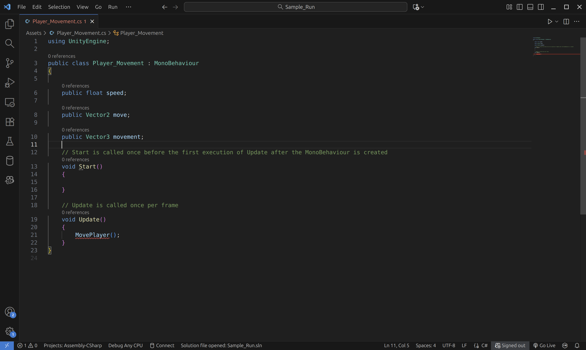

14. Add three variables before Start() but inside our main method:
    - *public float speed*
        - This will dictate the speed of our player object's movement 
        - Since this variable is **public**, we will be able to change the value of this variable on the fly once we're back in the Editor.
    - *public Vector2 move*
        - If you remember from earlier, our movement (inside our action map) is strictly in 2 directions (that's what we want). We limited our key bindings to Vector2. 
        - Thus, when we read our player's movements, they will be in a **2D vector** and will be placed inside an object of type **Vector2**
    - *public Vector3 movement*
        - Since our game world is a **3D space**, we need to translate our 2-dimensional movement into a 3D vector w/ the y-axis (straight up) set to 0. Which is why we need this variable.
            - Bonus question: why would we set the y-axis to 0 in our 3D vector?

 

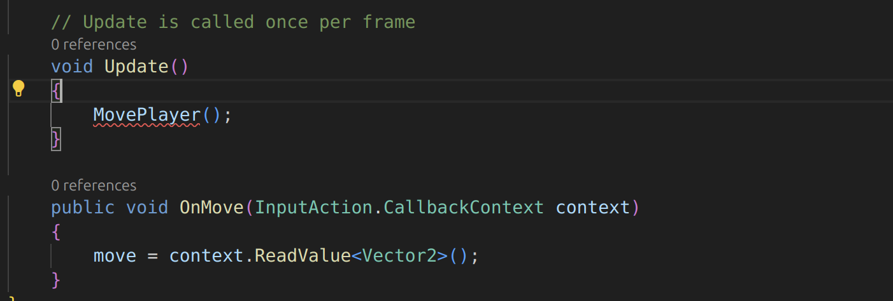

15. Add the following function after *Update()*:

    - public void OnMove(InputAction.CallbackContext context) {
        move = context.ReadValue< Vector 2 >();
    }

    - You may also need to import the following library up top with this line:
        - **using UnityEngine.InputSystem**
     
    - Imagine your player asset is a toy remote car:
        - Your keyboard/controller is the remote.
        - Unity's Input System is the "messenger".
        - The function *OnMove* is the car receiving the message.
        - The *CallbackContext* is the message itself (the message that you send to the function upon a button press).
            - The message says what you (the person controlling the car) want the car to do.
                - Move? Move where? How fast? Is this gonna happen once or continuously?
        - In this case, the message is a 2D vector indicating which direction we want to move in.
         

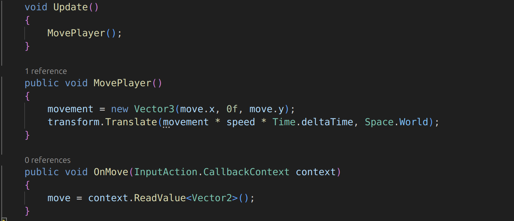

16. Define **MovePlayer()** using the image above. 

    - We placed the *movement = new Vector3(move.x, 0f, move.y)* line
        - What does it mean?:
            - Consider the following example:
                - In a 2D space like the one below:
                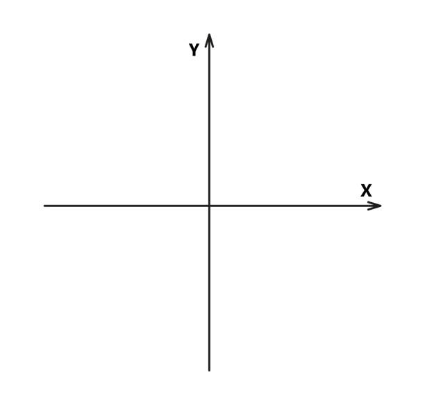
                - **(0,1)** would mean "move in the positive y axis" (i.e. upward)
                - But now, when we translate this 2 dimensional movement into a 3 dimensional world, we have to be careful.
                    - The y-axis is now upwards (directly upwards). The newly added z-axis is the new "forward" axis. And the x-axis is still for left and right movement.
                - So, when we map (0,1) from 2D to 3D, we would have to assign it like this (assume our 2D vector is called "move", like above, and our 3D vector is still "movement"):
                    - movement = new Vector3(move.x, 0f, move.y);
                - Why?
                    - As stated earlier, we don't move upwards with WASD. We only move along the x and z axes.
                    - Since our 2D vector is (0,1), our 3D translation of this 2D vector would be **(0, 0f, 1)**. Which means that we are now moving (in the 3D space) **1 unit in the positive z-axis (AKA forward)**
                    - Since this action is repeated every frame, in 60 fps gameplay, this will result in our character having smooth forward movement.
    - We also placed a new line:
        **transform.Translate(movement * speed * Time.deltaTime, Space.World);**
    - What does this line mean?
        - *transform* 
            - Refers directly to this game object's **Transform** attribute.
        - *.Translate* 
            - Allows us to move the object from its current position.
        - *movement * speed * time.DeltaTime*.
            - We multiply our speed value by our movement vector (so that we're not at a speed of 1 unit per frame).
            - This vector is then continuously added to the game object's position vector to move it.
        - *time.deltaTime* 
            - What is that?
            - This allows our player movement to be **frame-independent**.
                - Imagine that your computer runs the game at 60 fps (frames per second).
                - We can calculate the total # of units moved by the player by doing the following calculation:
                    - 60 * 5 (our speed, let's say) * movement ([0, 0, 1], let's say)
                    - Thus, we moved **300 units** in total
                - Let's assume your friend's PC runs the game at 120 fps.
                    - Then, by the same calculation (with the same movement), we'd move **600 units** in total when the game runs on their PC.
                        - That's not good! This means that the higher the FPS is, the faster we move.
                - This is why we multiply this entire expression by **time.deltaTime** (whose value is roughly equal to 1/your fps amount). 
                    - 60 * 1/60 = 1 
                    - 120 * 1/120 = 1. 
                        - Therefore, our movement stays **consistent** across different machines (since we're just multiplying by 1). 
        - *Space.World*
            - This allows our player object to move relative to the **game world's global axes.**
            - This means that, regardless of where the game object is or what direction it's facing or what orientation the camera is in, when we press "W", we will always move in the direction of the **game world's** positive z-axis.
            

 

#### Now, let's go back to the Unity Editor.

 

17. Click on the **jearl_backwards** (either in the Scene Panel on the left or in the Scene itself) asset to view its components.

18. In the **Player Input** component, find the **Behavior** attribute.
19. Change its value from **Send Messages** to **Invoke Unity Events**.
20. Right underneath, click and open the **Events** dropdown.

21. Click and expand the **Player** dropdown
22. If the previous steps were followed correctly, you should see a box labeled **Movement (CallbackContext)**
23. Click the **Plus** icon at the bottom right of the box.
24. In the blank attribute, drag and drop the **jearl_backwards** asset into it.
25. Open the **No Function** dropdown
26. Again, if the previous steps were followed and you **saved** your script, you should see an option called **Player_Movement** (which is the name of one of the functions we created in our movement script)
    - Click and expand it
27. In the following menu, at the top, you should see **OnMove** (which is our Input function for movement)
    - Click it.
28. What all this did is assign the **OnMove** CallbackContext function to our player object. Now, whenever we press WASD (buttons associated with **movement**), those key inputs will be read and sent to this function.

#### Fatal error (this is me from a couple minutes in the future). I just realized that I placed down the assets in the wrong way. If you've been following this tutorial, when you ran the game, your player is likely moving in the complete opposite directions.

#### Fix: Swap the positions of your *motor_oil* and *jearl_backwards* assets and also turn the camera so it is properly oriented and centered on our player (the blue axis should be facing away from the camera). Like this:
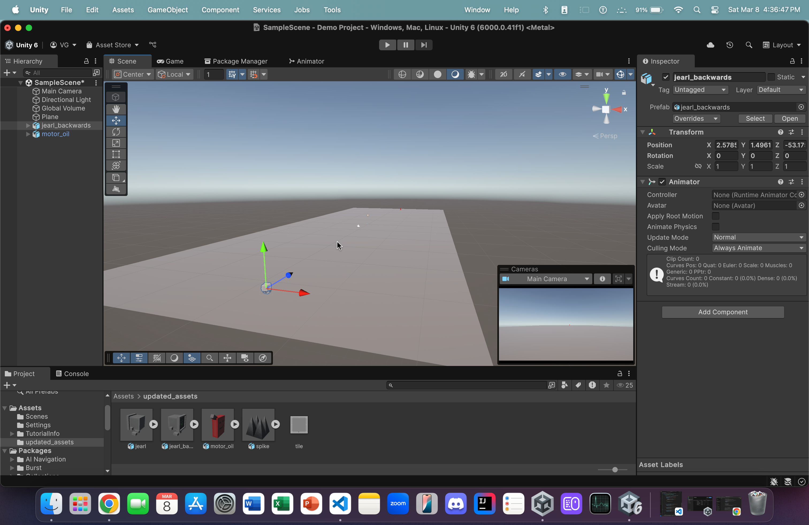

  

#### Run the game and you should be able to move! But, you'll notice that the player is "stiff". He's always looking in the same direction. Let's change that so that the player looks in the direction that we're moving in!
 

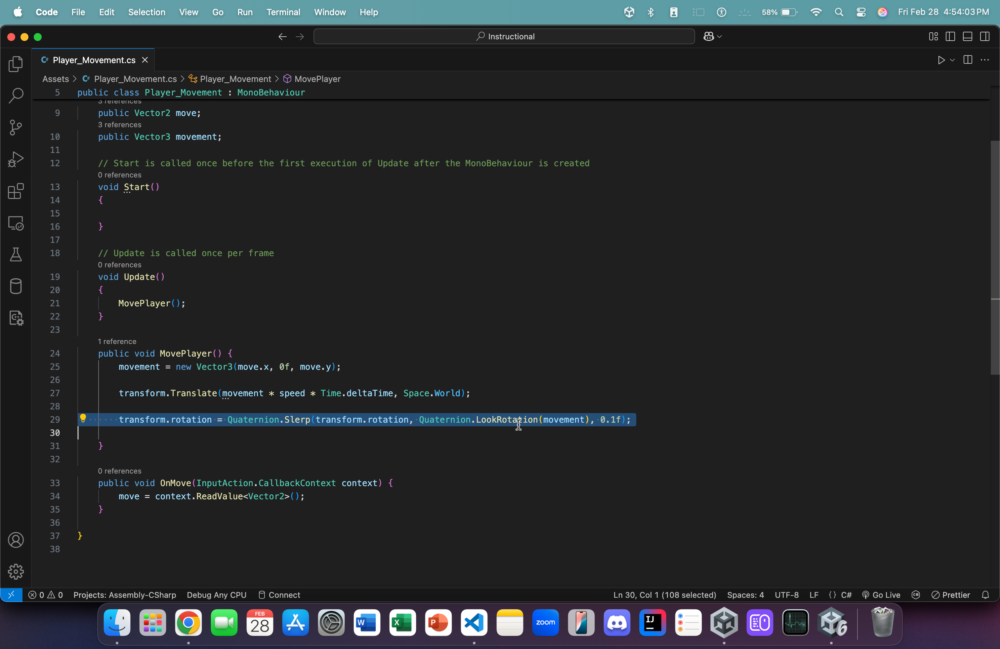

29. Back in our script, add the following line inside the **MovePlayer**: 
    - *transform.rotation = Quaternion.Slerp(transform.rotation, Quaternion.LookRotation(movement), 0.1f);*
    - What does this mean?:
        - *transform.rotation*
            - Now, we're accessing this game object's rotation characteristic (before, it was translation)
        - *Quaternion.Slerp(...)*
            - In mathematics, **Quaternions** are objects that are used to represent rotations in a 3D space
            - The function *.Slerp()* takes two such quaternions and interpolates (or transitions) between them with a given strength (indicated by a floating-point number).
        - *(transform.rotation, Quaternion.LookRotation(movement), 0.15f)*
            - Here, our two quaternions are:
                - *transform.rotation*
                    - This object's current rotation
                - *Quaternion.LookRotation(movement)*
                    - The rotation that's required to face in the direction of the given 3D vector (we used the Quaternion class's built-in function, LookRotation, to achieve this)
                - *0.1f*
                    - We transition between these two rotations with a strength of 0.1 (which is slow enough to see the transition)
                        - Our game object will smoothly transition between rotations (instead of snapping) when we press WASD.

#### Now, when you go back to the Editor, let the new script update, and hit Play, you should see movement and the player object rotate (i.e. look) in the direction of the movement. Isn't that cool?
                
    
#### Now, let's add some jumping functionality

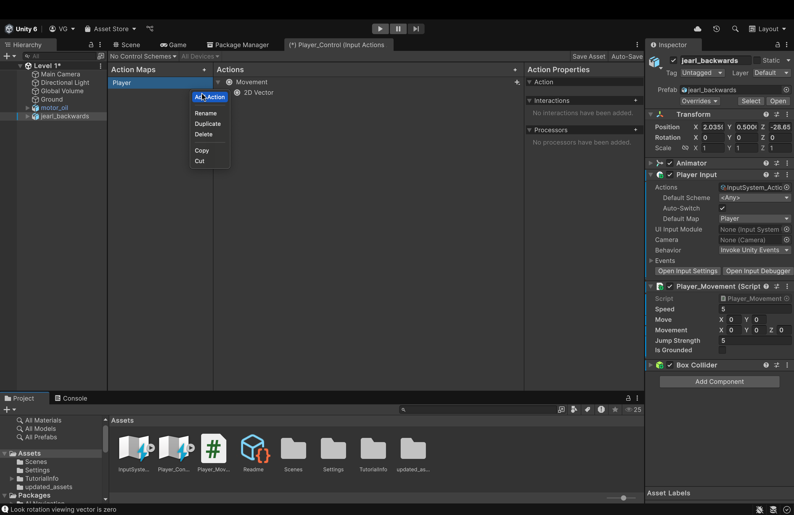

30. Open the **Player_Control** action map. Then, right click on the "Player" action map and hit *Add Action*.
 

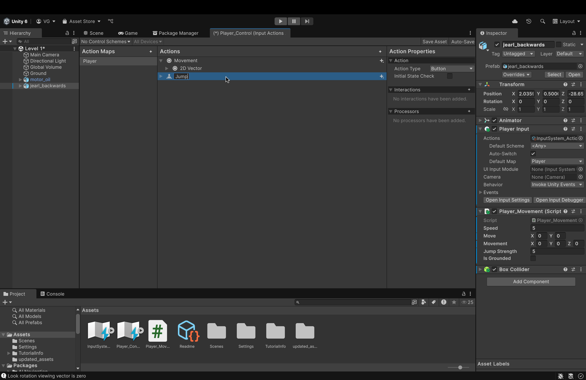

31. Click once on the newly created action, press `Enter`, and rename it to **Jump**.
    - Also, in the right-hand panel, ensure that the *Action Type* attribute for this action is **button** (we will press the jump button once to jump. not hold it)
 

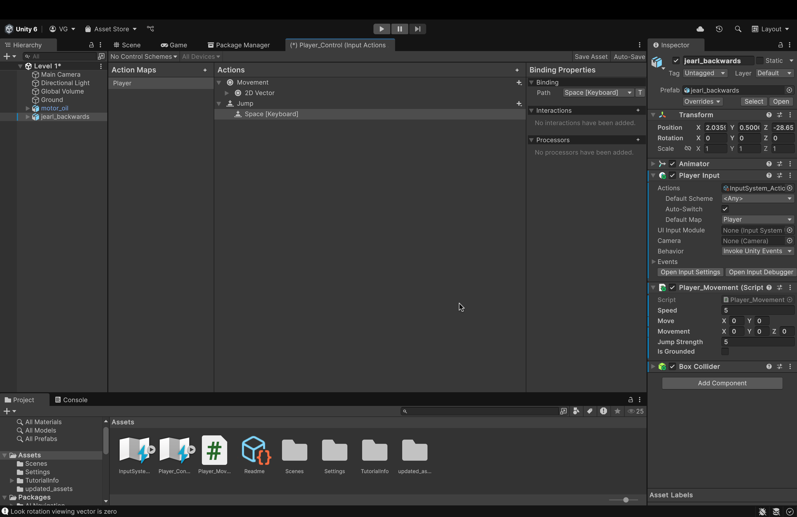

32. In the middle panel, next to **Jump**, click the triangle to view its contents.
    - Click on **< No Binding >**.
    - Over to the right, open the *Path* dropdown and either search for the **Spacebar** key or use the *Listen* feature (like earlier).
    - Select Spacebar from the search results to assign it to the empty key binding.
    - Make sure to click **Save Asset** in the top right.
 

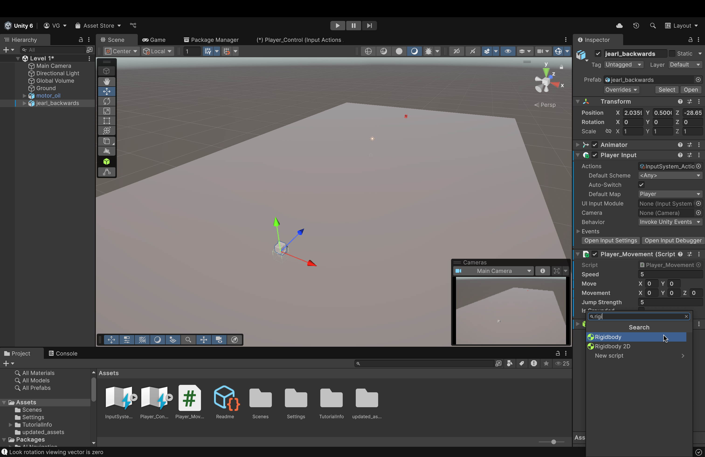

33. Back in our Scene View, click on **jearl_backwards** to access its components
    - Click on *Add Component* and, in the search bar, start typing **Rigidbody**. You should see it in the search results. 
    - Click on **Rigidbody** to add it to our player object
    - What's the point?
        - This component enables our player object to now be affected by physics (i.e. gravity)
        - Without this, our jump functionality would not work and be very wonky
 

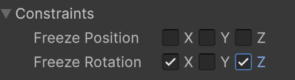

34. Inside of the Rigidbody component, under the *Constraints* dropdown, check the boxes for the X and Z axes for **Freeze Rotation**
    - Why?
        - This will prevent unwanted rotations or leaning when our player interacts with or collides with any uneven surfaces.
        - Locking these two axes ensures that our jump force is only applied to the y-axis (directly up) and nowhere else.
 

#### Let's make a few changes to our script

 

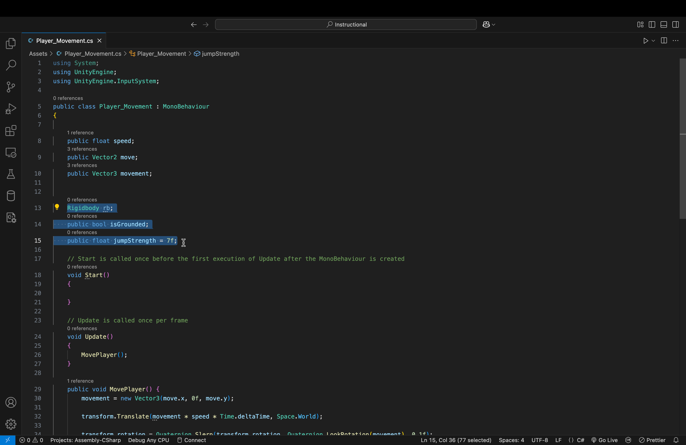

35. Add the following three variables up top:
    - *Rigidbody rb;*
    - *public bool isGrounded;*
    - *public float jumpStrength = 7f;*
     
    - Let's take a look at these:
        - *Rigidbody rb;*
            - This will hold the Rigidbody component of this object (the object that this script is attached to). Which will allow us to add forces to it later
        - *public bool isGrounded;*
            - This ensures that we can only jump again once we have landed (and not at any other time)
            - Simply relying on collisions can cause some errors.
            - Without this check, we could either fall through the ground or keep jumping up forever and never land.
        - *public float jumpStrength = 7f;*
            - Self-explanatory. Allows us to tweak the strength of our jump (we can also give custom values in the editor itself)

 

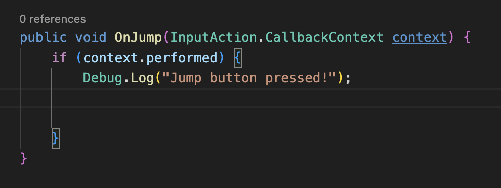

36. Underneath our *OnMove* function, add this function.
    - The syntax is mostly the same except for one key difference...
        - **context.performed**
            - Remember, we are not pressing and holding the jump button. This is a one-and-done type of action
            - Therefore, we do not need to constantly read a value from the action map (like *OnMove*)
                - We just need to check, once, whether or not we received a context (message) from our key binding (the jump button)
                    - If we did, we print a message to the console
 

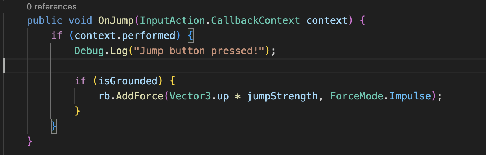

37. Add the *if* statement that you see up above **inside** our earlier *if* statement.
    - What does this even mean?:
        - We **nested** this addition inside of our *context.performed* if statement.
            - This ensures that if we press the jump button while the player object is airborne, we won't add more force to the player (i.e. double jump)
                - Not necessarily a bad thing. Feel free to implement this later if you want to.
            
        - *if (isGrounded) {...}*
            - If isGrounded is true (i.e. we are on the ground)
        - *rb.AddForce(Vector3.up * jumpStrength, ForceMode.Impulse)*
            - We will add an impulse force (instantaneous force) to our Rigidbody component, which will, in turn, affect the player object.
            - This force will be equal to the 3D up vector (whose value is (0, 1, 0)) multiplied by our jump strength.

 

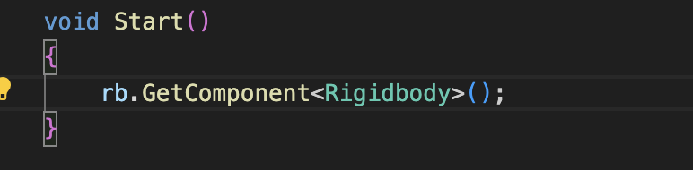

38. In our *Start* function, add the above line
    - This allows us to actually access and store this object's Rigidbody component inside of our variable to use in our script.
    - We placed this inside *Start()* so that this action is only performed once. We access the Rigidbody component once, store it, and that's it.
    - EDIT (This is me from the future) --> Change this line from **rb.GetComponent...** to **rb = GetComponent...**

 

#### But, how can we actually check if the object has even landed to then enable it to jump again?
#### The answer? With *collisions*

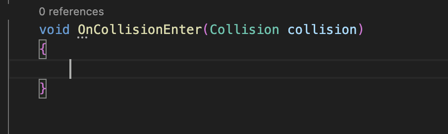

39. Add the following function below our *OnJump* function.

    - Do note that this is a built-in function that we are simply overwriting. 
    - Intellisense and autocomplete should kick in as soon as you start typing the function name.
    - Upon any collision, Unity, by default, calls this method. The physics engine is fast enough to even call this multiple times per frame.

 

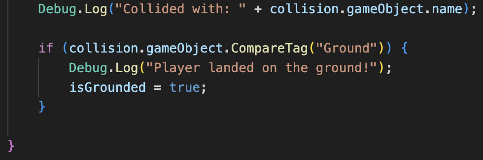

40. Add the following *if* statement to the function body.
    - What does this mean?
        - *Debug.Log(...)*
            - This is here to ensure that a). a collision occurred and b). it occurred with the correct object.
        - *if (collision.gameObject.CompareTag("Ground")) {*
            - When a collision occurs, the collision variable in our method signature will be given information about the collision.
                - The *"collision."* refers to the collision that just occurred.
                - The *".gameObject"* refers to the other object that **this** object collided with
                - The *.CompareTag* checks if that other object held a tag of "Ground" (we'll go over what this is in just a little bit).
            - So, if the other object in the collision that just happened with our object is tagged with the tag "Ground", then...
                - We set *isGrounded* to true (i.e. we have landed). 

 

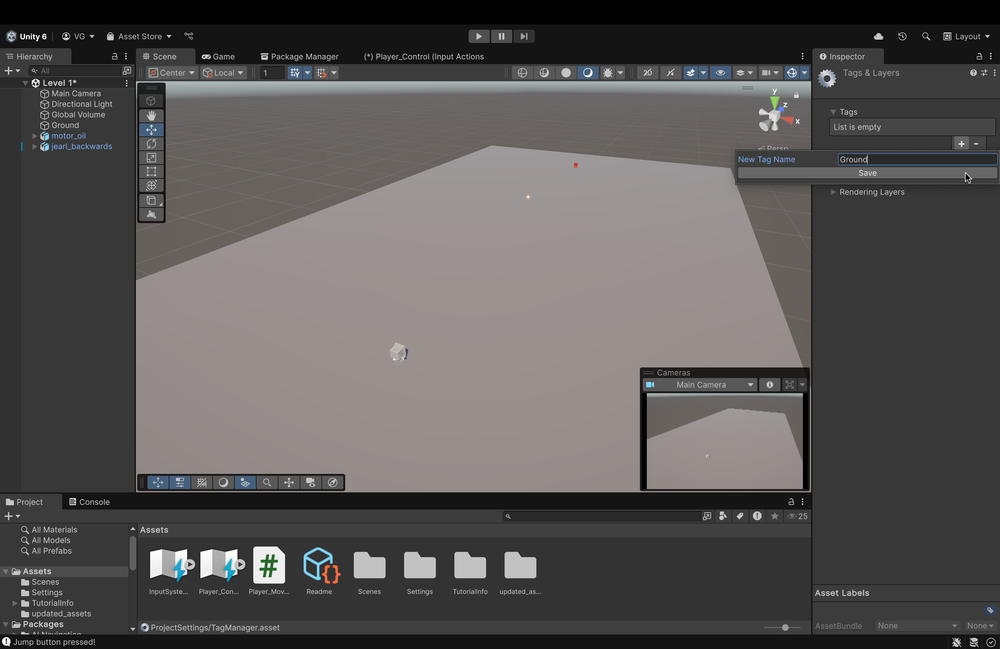

41. Let's add a tag to our **Plane** game object.
    - Back in the Editor, click the **Plane** object to view its components.
    - In the Component Panel (on the right), up top (underneath the object's name), find the **Tag** attribute.
    - Click the dropdown menu next to it to expand it.
    - Click **Add Tag...**
    - In the new window, click the **plus** icon.
    - Name your tag **Ground** (name it EXACTLY the name we used in our if statement in the collision function in our script).
    - Click **Save**.
    - Click on the **Plane** ground object to see its components. Again.
    - Find the **Tag** attribute and the dropdown.
    - Open the dropdown and you should see your newly created tag in the list.
    - Click it to assign it to this object.
        - Unity does **NOT** do this automatically. So, don't forget this step!
 

42. You remember earlier when we configured the **OnMove** function in our **Player Input** script? This time, we need to do the exact same thing, but for the **OnJump** function!
    - Click on **jearl_backwards** to view its components.
    - In the **Player Input** script, open the **Events** dropdown (same as before).
    - Open the **Player** dropdown.
    - If you see a new box labeled **Jump (CallbackContext)**, repeat the same steps as before:
        - Click the **plus** icon
        - Drag our player object into the empty box below **Runtime**
        - In the bigger dropdown, find our movement function.
        - Open it.
        - You should see an option for **OnJump**
        - Click that and you're good.
30. Make sure to add a **Box Collider** component to your game object. The process is that same as any other component. Simply add it and that's it.

#### So now, assuming everything was set up correctly, upon running our game, you should be able to move AND jump! 

#### Now, for a final touch (before moving on to animations), let's fix the position of our camera

 

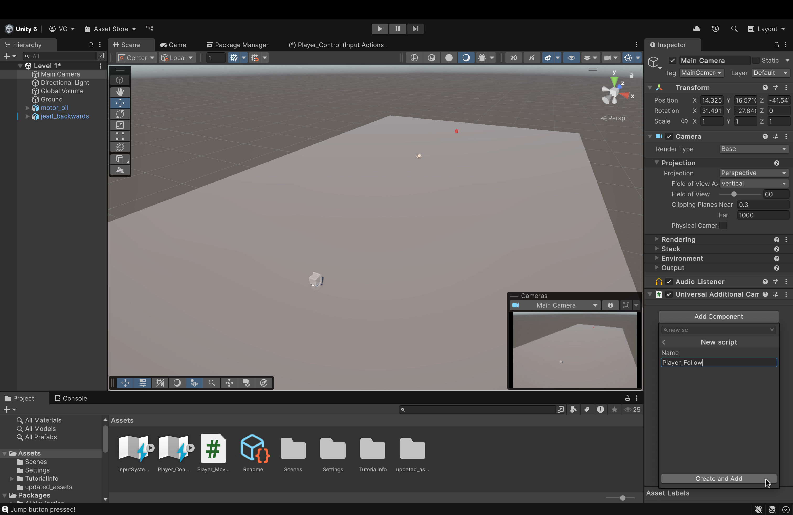

43. Let's make a new script for our *Main Camera* object
    - Click on the **Main Camera** to open its Component view on the right side.
    - At the bottom, click *Add Component* and type in the box *New Script*
    - Let's name the script *Player_Follow*
    - Once created, double-click to open it.

 

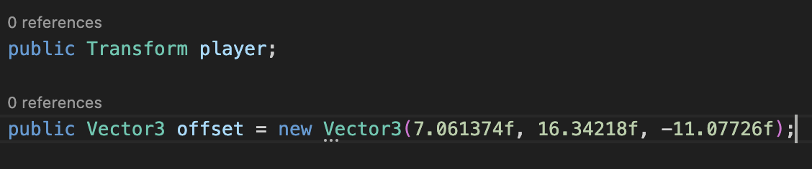

44. Let's add the following variables first:
    - What do they mean?:
        - *public Transform player;*
            - We will need this later to hold information about our player object (we'll just click and drag our player object into this variable in our Editor later).
        - *public Vector3 offset = new Vector3(...)*
            - This is the three dimensional position that the camera will be locked at.
            - Note: These are coordinates that I decided to use after a bit of trial and error (I just like how the camera sits at this position).
                - You can experiment yourself to find the location that you find better.
                - Move the camera to that position. Then, just copy its *Position* values (from **Transform**) into this Vector3 variable.
    

 

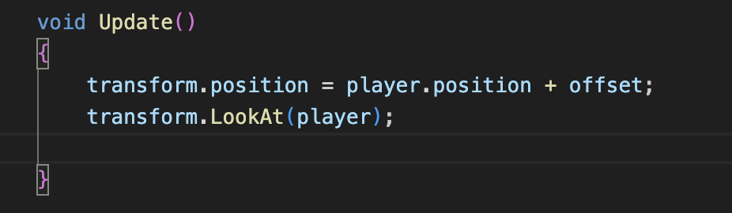

45. Now, we'll add the lines up above into the *Update()* method
    - What does this mean?
        - *transform.position = player.position + offset;*
            - We're gonna take the position of this game object (the object that this script is attached to) and add to its position (which is in three dimensions) the position of the offset that we set up above.
        - *transform.LookAt(player);*
            - This line will apply a rotation to this game object (the camera) that will ensure that its forward vector (the z-axis vector) is pointing directly at the specified game object (which we'll set to our player object in the Unity Editor).

 

#### Now, when you return to the Unity Editor and look at the Main Camera's components, make sure to drag *jearl_backwards* into the empty slot next to the *Player* variable. Run the game and see if the camera is attached to the player object.

## We are now finished with the input configuration. Next, we will add animations to the player object

