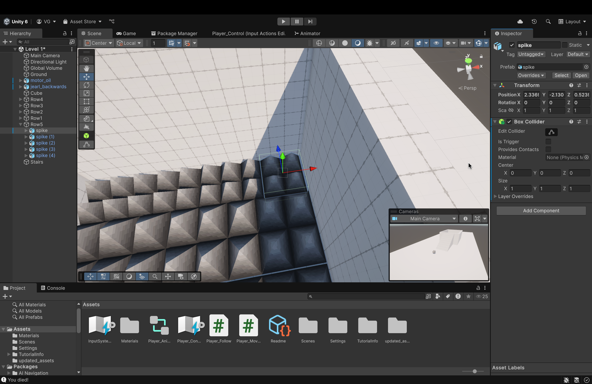
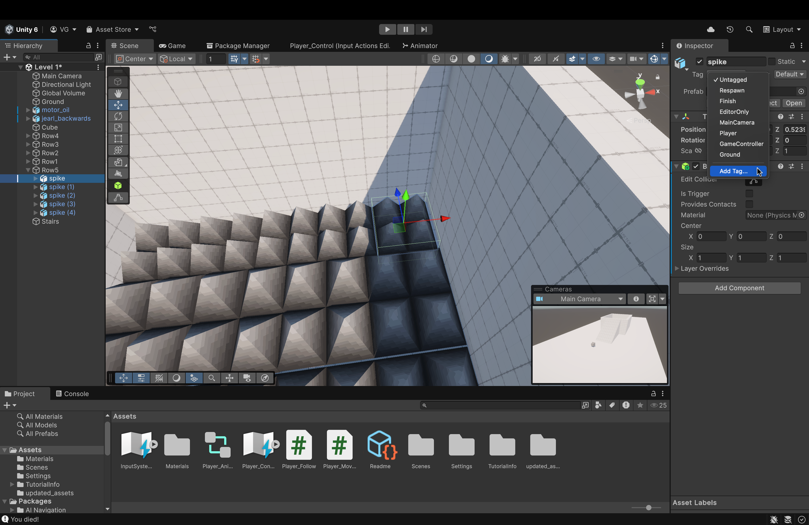

### Now, we'll discuss a particular tool that we downloaded a while back: 

# Probuilder

 

1. For the Mac folks, hover over *Tools* up top, then hover over *ProBuilder* to open/view the menu
    - If you recall, earlier in the tutorial, we downloaded two packages: Unity glTFast and **Probuilder**.
    - **ProBuilder** allows us to create shapes of different sizes and patterns. 
        - You might say, "Ok. So what?"
        - Well, these shapes, no matter what size you make them in, will have their own colliders and renderers (there is a slight caveat here that we'll discuss later)
 

2. Let's create a spike pit!
    - To start, let's create a *Cube*
        - In the *ProBuilder* menu, hover over *Editors* and find the *Create Shape* menu
        - Within that menu, click on *Cube* to enter build mode

 

3. Click and drag, in build mode, to see a grid pop up.
    - This grid represents the base of our shape (a cube, in this case). As you hold down the left-click, you can drag that shape to whatever dimensions you want to size our base
        - For this tutorial, ensure that your base is somewhat of an **rectangle** which is longer on the **z-axis** than the **y-axis**
            - Think of a football field
            - If its not perfect, don't worry! We can resize its transformation values with numbers later
 

4. Once you've decided on the proportions of your base, let go of *left-click*
    - Now, move your cursor up and you should see the shape "rise up".
        - What you're seeing is a *preview* of what the final shape will look like
        - Once you've chosen your desired height, press *left-click* once to finalize the shape
 

5. Now, if we want to edit the shape (if we didn't size it the correct way, let's say), we can do that by:
    - Opening the *ProBuilder* menu from the *Tools* menu up above.
    - Inside the *ProBuilder* menu, this time, hover your cursor over **Edit**
    - In the menu that follows, click **Edit Shape**
        - You will enter back into *build mode* (the same mode you were in when you were first creating the shape)
        - One thing to remember: to change the *scale* parameters (i.e., size), you **MUST** do it from the **Shape Settings** menu and not the *Component View* on the right.  
    - Now, in the **Shape Settings** menu, change the *Size* parameters to the following values:
        - X --> 14
        - Leave Y as is
        - Z --> 22
 

6. Now, we need to change this rectangle into a pit (i.e. a concave rectangle with thick walls)
    - We'll do this by **Extrusion** and **Edge Loops**
    - To begin, find the above icon in the vertical bar on the left of the *Scene View*
        - This icon will only be visible if you have selected a shape created using ProBuilder
    
 

7. Along the top row of icons, you'll find these 3 icons as well (with the same color)
    - From left to right:
        - **Vertex Selection** = Allows you to select individual vertices and use them to change your shape however you want
        - **Edge Selection** = Allows you to select edges and use them to change your shape
        - **Face Selection** = Allows you to select faces to change 
        your shape
 

8. Click on the *Edge Selection* icon to get started 
    - You should all the edges turn dark black and when you hover, they should change colors.
        - Pick an edge (I'll start with the one that's selected in the image)
        - Right-click with the edge selected to open a menu
        - In that menu, find **Insert Edge Loop**
            - Here, you'll also see a shortcut to invoke this option. I suggest you use this shortcut because we'll be making a couple of these
 

9. Once you click **Insert Edge Loop**...
    - ProBuilder will introduce a new edge **perpendicular** to the one you selected. 
        - I double-click on the *Scene* to make the scene full-screen.
 

10. Once you click **Insert Edge Loop**...
    - ProBuilder will introduce a new edge **perpendicular** to the one you selected. 
        - I double-click on the *Scene* to make the scene full-screen.
 

11. Drag the edge over to the right
    - You want to space it a given distance from the rightmost edge (the original rightmost edge) and keep that distance consistent for the edge on the opposite side (when we place it)
        - This ensures that our walls have an even thickness
            - No need to make it perfect. Eyeballing will work just fine. Just keep them relatively consistent without any large differences.
 

12. Now, let's select one of the longer edges (like the one shown in the image) 
    - Right-click to open the menu and click **Insert Edge Loop**
    - With the newly created edge, drag it down towards the *original* bottom edge
        - Orient the camera however you need to place this edge just right (whatever that is for you)
 

#### Now, repeat the previous two steps to place the remaining two edges. The final product should look something like this

 

13. Now, select the middle face (the biggest face) by switching to the **Face Selection** tool. We will now **extrude**

- Why did we do this?
    - Placing these additional edges allowed us to create additional faces on top of an existing face.
    - We can then select any one face (or multiple faces) and **extrude** (i.e. cave inwards or pull outwards), whichever we need to do.
 

14. With the face selected, *right-click* to open the menu again and find **Extrude Faces**
 

15. Now, **drag** the face down to extrude it (in this case, cave inwards)
    - Once done, press `Esc` to exit ProBuilder
 

#### Now, we have our pit ready. Next, we need to fill it with spikes
 

16. Drag and drop the **spike** asset into the scene from the *updated_assets* folder.
 

17. Make a row of spikes
    - We can do this by selecting a spike and pressing `Ctrl` + `C` then `Ctrl` + `V`
    - Doing so makes a copy of the selected asset
        - Note: the copy will be placed in **EXACTLY** the same position as the original. So, you need to drag it out to separate it from the original
    - Create 4 more copies so that we have a row of 5 spikes (like the one in the image)
 

18. Next, we need to group our spikes together so that we can edit the entire row as a whole
    - To do so, *Right-click* in the *File System* (where we can see all of our assets) and find the **Create Empty** option
        - Name the empty asset *spike_row_1*
        - This will create a blank folder (that acts as an asset)
    - Into this folder, drag all of the spike assets.
 

19. Here's where it gets a bit complicated:
    - You now need to use the **Scale Tool** (which is the 5th one from the top in the menu to the left in the image above)
    - Using this tool, scale the size of the row such that it fits inside of the walls of the pit without clipping through the walls or the ground
        - This will take some trial-and-error and not everyone will have the same amount of work to do.
 

20. Now, we need to copy and paste the rows on down (from back to front) to fill the "pit" with spikes.
    - Again, this is a step that not everyone will a similar experience performing.
    - Do size and resize the rows themselves using the **Scale Tool**
        - If you look closely, my rows are not perfect either. Some are slightly larger than the others.
    - Eventually, your pit should look something like the image above and you should see a bunch of copies of the spike rows on left in your **File System**
 

#### Next, rename the rows so that you have an easier time keeping track of which is which (I like to name the row furthest from the player "Row 5" and work my way down to "Row 1")
 

21. Back in our Player_Movement script, add the following library: **UnityEngine.SceneManagement**
    - This will allow us to switch scenes when we detect a collision (which we'll change further down in this script);
 

22. Inside the **OnCollisionEnter** function, add the else statement in the image above following the first if statement (which checks for a collision with *Ground*)
    - Here, we're doing the same thing. We're checking if the player object has collided with any object tagged "Obstacle" (we'll tag the spikes later)
        - If it has, we load the scene **Level 1**
            - This is the same scene that we're on currently. So, esentially, we'll just reload the game (since we died after coming into contact with the spikes)
 

#### Let's go back to the Scene View!
 

23. We will now make some stairs (you can probably tell where I'm going with this)
    - In the ProBuilder menu (up top, under *Tools*), hover your cursor over *Editors*
    - Then, hover over *Create Shape*
    - Now, in the next menu, click on **Stairs**
 

24. The creation for the stairs is the same as the *Cube* from earlier.
    - Create the base and then drag the cursor up to create the height of the shape
 

25. Try to get the height of the stairs almost level with the height of our cube (don't worry if it isn't since we'll be able to fine-tune this later)
    - Use the **Rotate Tool** (which is the 4th one from the top in the bar to the left in the image above) to turn the stairs around
        - Use `Ctrl` or `Cmd` to rotate in increments (instead of freeform rotation without increments)
 

26. After sizing the stairs (using ProBuilder's *Shape Settings* menu, **NOT** the settings in the component view), we can then adjust the number of steps in the stairs
    - We want our player to move smoothly up the stairs without the need to jump constantly
    - Somewhere around **60** steps should be good enough
 

27. Now, for each spike in every row, we need to add two things:
    - A collider and a tag (**Obstacle**)
        - Let's add the collider first
            - Select any one of the spikes in your row and add a **Box Collider** component 
                - This will keep things simple and not have to much of a burden on performance
 

28. Now, let's create a tag called "Obstacle"
    - Click on the *Tags* dropdown for the selected row and click *Add Tag..."
    - In the next menu, click the **Plus** icon to create a new tag and name it **Obstacle** (it should be exactly the same as how you spelled it in the code)
        - Double check to ensure correct spelling
    - Navigate back into the *Component View* of the spike itself and add the tag to it
        - You should see in the *Tags* dropdown menu
 

#### Now, repeat the previous step for the every spike in every row (miuus the creation of the tag). The tag is already made. You just need to assign it.
 

#### Now, run your game, walk up the stairs, and fall and the scene should reload upon contact with the spikes.

