### Now, we'll discuss a particular tool that we downloaded a while back: 

# Probuilder

 

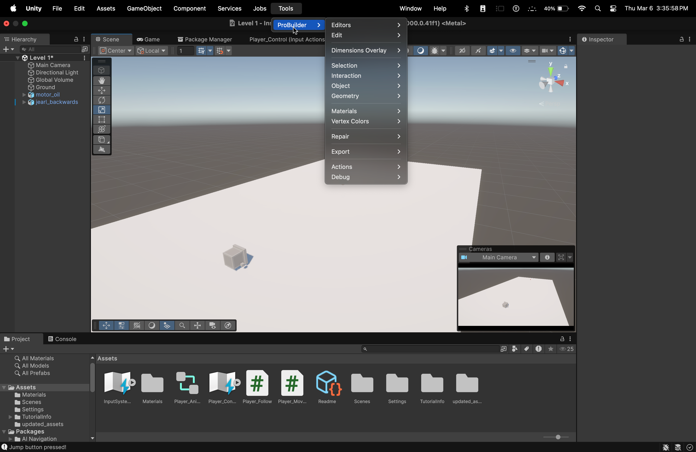

1. For the Mac folks (works the same for Windowns as well), hover over *Tools* up top, then hover over *ProBuilder* to open/view the menu.
    - If you recall, earlier in the tutorial, we downloaded two packages: Unity glTFast and **Probuilder**.
    - **ProBuilder** allows us to create shapes of different sizes and patterns. 
        - You might say, "Ok. So what?"
        - Well, these shapes, no matter what size you make them in, will have their own colliders and renderers (with a slight caveat that we'll discuss later)
 

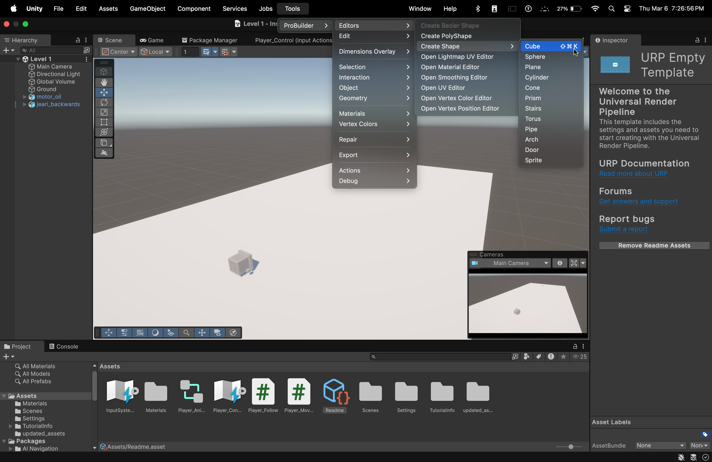

2. Let's create a spike pit!
    - To start, let's create a *Cube*
        - In the *ProBuilder* menu, hover over *Editors* and find the *Create Shape* menu.
        - Within that menu, click on *Cube* to enter build mode.

 

3. Click and drag, in build mode, to see a grid pop up.
    - This grid represents the base of our shape (a cube, in this case). As you hold down the left-click, you can drag that shape to whatever dimensions you want to size our base.
        - For this tutorial, ensure that your base is somewhat of an **rectangle** which is longer on the **z-axis** than the **y-axis**.
            - Think of a football field!
            - If its not perfect, don't worry! We can resize its transformation values with numbers later.
 

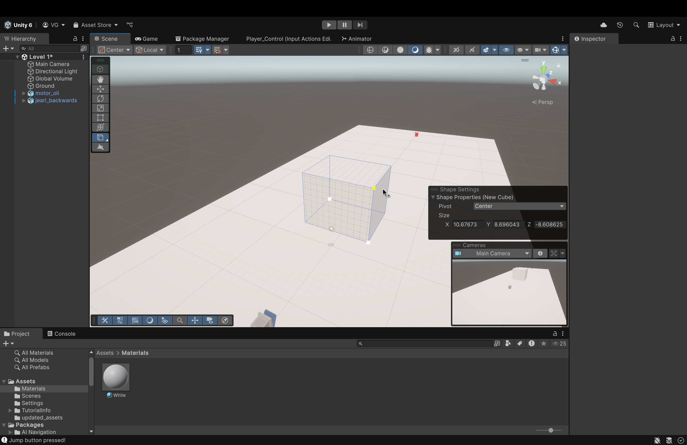

4. Once you've decided on the proportions of your base, let go of *left-click*.
    - Now, move your cursor up and you should see the shape "rise up".
        - What you're seeing is a *preview* of what the final shape will look like
        - Once you've chosen your desired height, press *left-click* once to finalize the shape
 

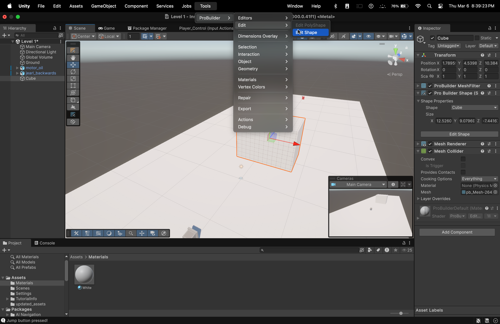

5. Now, if we want to edit the shape (if we didn't size it the correct way, let's say), we can do that by:
    - Opening the *ProBuilder* menu from the *Tools* menu up above.
    - Inside the *ProBuilder* menu, this time, hover your cursor over **Edit**
    - In the menu that follows, click **Edit Shape**
        - You will enter back into *build mode* (the same mode you were in when you were first creating the shape)
        - One thing to remember: to change the *scale* parameters (i.e., size), you **MUST** do it from the **Shape Settings** menu and not the *Component View* on the right.  
    - Now, in the **Shape Settings** menu, change the *Size* parameters to the following values:
        - X --> 17
        - Leave Y as is
        - Z --> 25
 

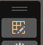

6. Now, we need to change this rectangle into a pit (i.e. a concave rectangle with thick walls)
    - We'll do this by **Extrusion** and **Edge Loops**.
    - To begin, find the above icon in the vertical bar on the left of the *Scene View*.
        - This icon will only be visible if you have selected a shape created using ProBuilder
    
 

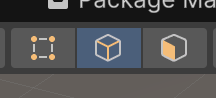

7. Along the top row of icons, you'll find these 3 icons as well (with the same color).
    - From left to right:
        - **Vertex Selection** = Allows you to select individual vertices and use them to change your shape however you want.
        - **Edge Selection** = Allows you to select edges and use them to change your shape.
        - **Face Selection** = Allows you to select faces to change 
        your shape.
 

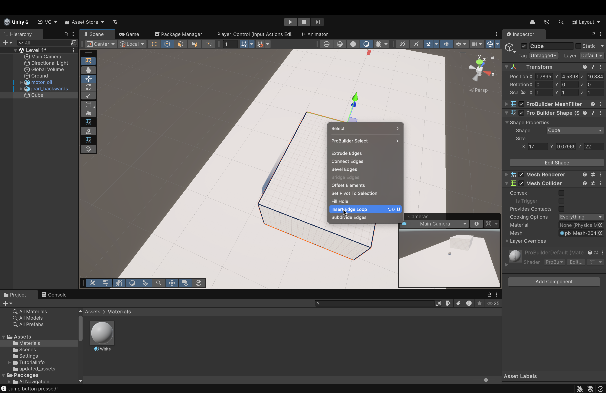

8. Click on the *Edge Selection* icon to get started.
    - You should all the edges turn dark black and when you hover, they should change colors.
        - Pick an edge (I'll start with the one that's selected in the image).
        - Right-click with the edge selected to open a menu
        - In that menu, find and click**Insert Edge Loop**.
            - Here, you'll also see a shortcut to invoke this option. I suggest you use this shortcut because we'll be making a couple of these
 

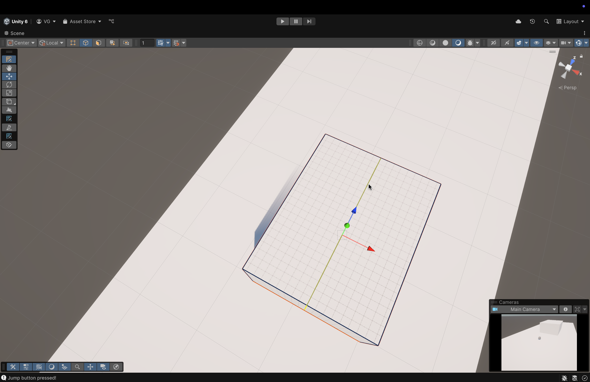

9. Once you click **Insert Edge Loop**...
    - ProBuilder will introduce a new edge **perpendicular** to the one you selected. 
        - I double-clicked on the *Scene* to make it full-screen.
 

10. Once you click **Insert Edge Loop**...
    - ProBuilder will introduce a new edge **perpendicular** to the one you selected. 
        - I double-click on the *Scene* to make the scene full-screen.
 

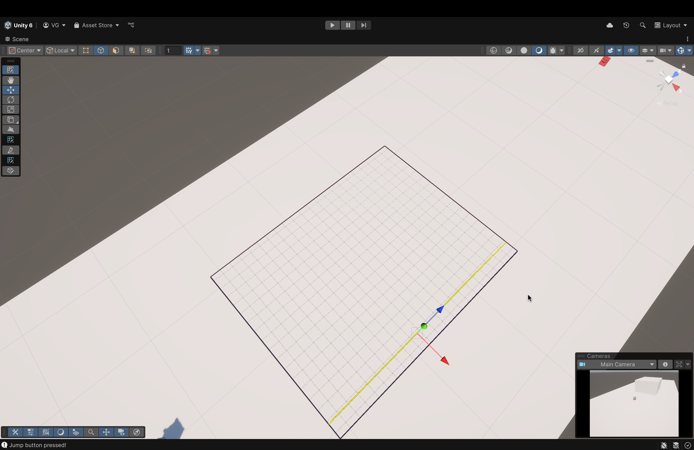

11. Drag the edge over to the right.
    - You want to space it a given distance from the rightmost edge (the original rightmost edge) and keep that distance consistent for the edge on the opposite side (when we place it).
        - This ensures that our walls have an even thickness
            - No need to make it perfect. Eyeballing will work just fine. Just keep them relatively consistent without any large differences.
 

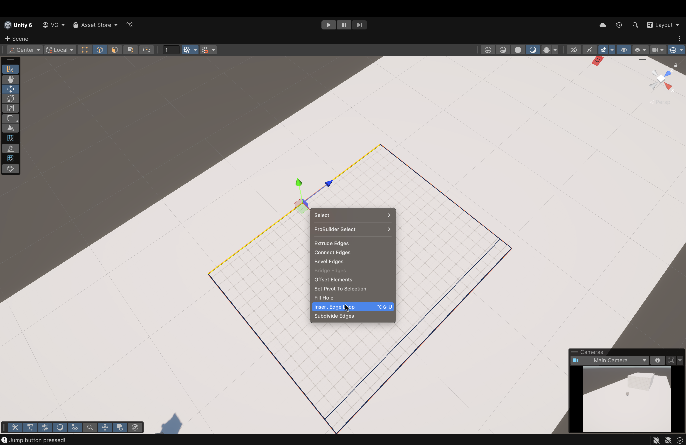

12. Now, let's select one of the longer edges (like the one shown in the image) 
    - Right-click to open the menu and click **Insert Edge Loop**
    - With the newly created edge, drag it down towards the *original* bottom edge
        - Orient the camera however you need to place this edge just right (whatever that is for you)
 

#### Now, repeat the previous two steps to place the remaining two edges. The final product should look something like this

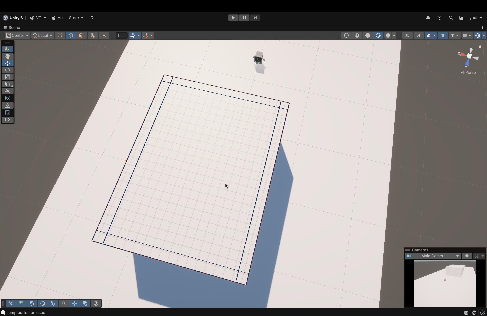
 

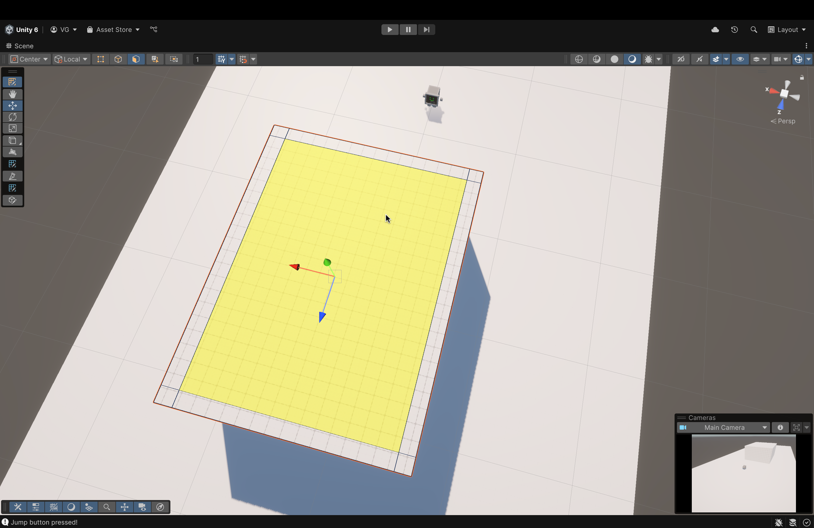

13. Now, select the middle face (the biggest face) by switching to the **Face Selection** tool. We will now **extrude**

- Why did we do this?
    - Placing these additional edges allowed us to create additional faces on top of an existing face.
    - We can then select any one face (or multiple faces) and **extrude** (i.e. cave inwards or pull outwards), whichever we need to do.
 

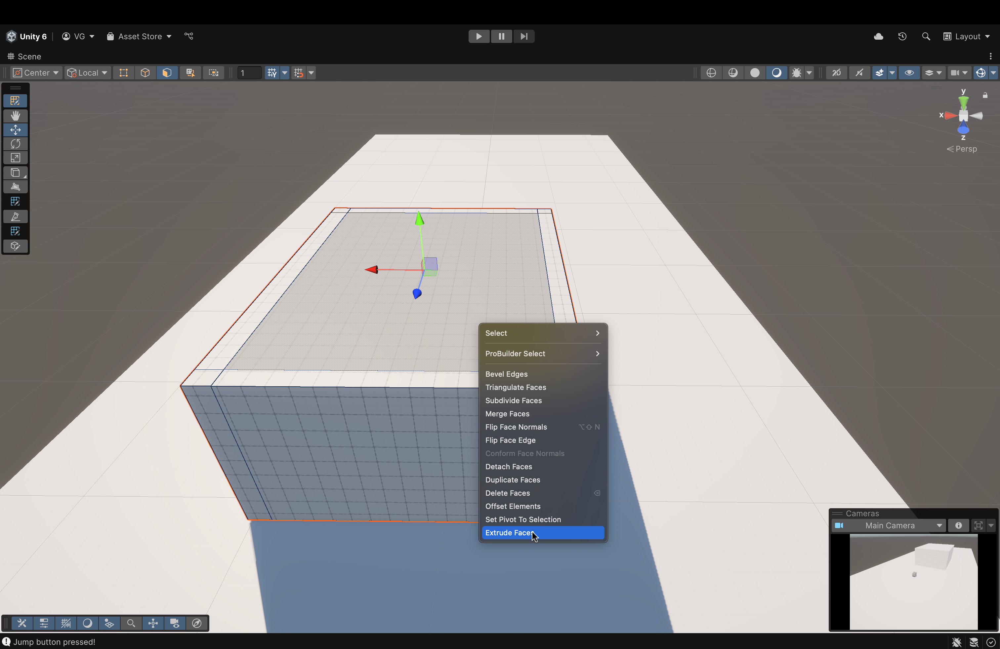

14. With the face selected, *right-click* to open the menu again and find **Extrude Faces**
 

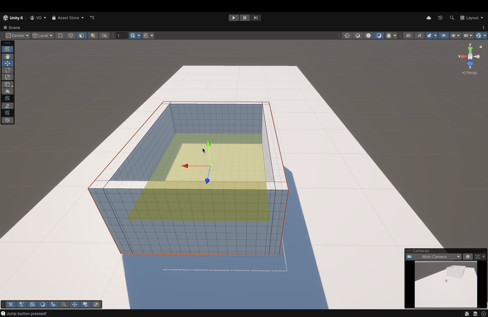

15. Now, **drag** the face down to extrude it (in this case, cave inwards)
    - Once done, press `Esc` to exit ProBuilder
 

#### Now, we have our pit ready. Next, we need to fill it with spikes. But, before that, let's make some adjustments in our player movement script!
 

15. In our **Player_Movement** script, at the top, add the following import statement:
    - **using UnityEngine.SceneManagement;**
        - This will allow us to the use the Scene Management class, which will allow us to transition between scenes upon collisions.
 

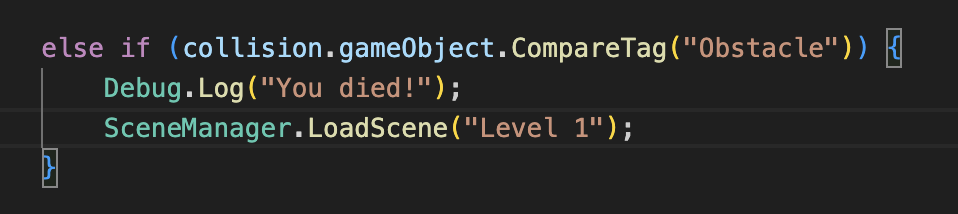

15. Next, in the **OnCollisionEnter** function, add the *else if* statement in the image above after the first *if* statement.
    - This statement uses the same functionality as the previous statement where it checks for a tag in the **other** object upon a collision with **this** object. 
    - This time, we're checking for an **Obstacle** tag.
        - If the other object has this tag...
            - We print an announcement to the console and...
            - We **reload** our current scene (using its name).
                - This is the reason why we imported that library from earlier.
 

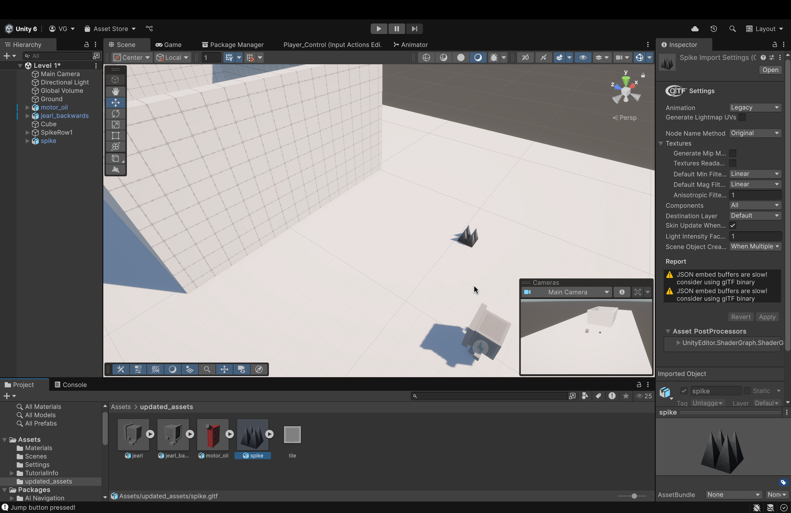

15. Navigate back to the Editor
    - Drag and drop the **spike** asset from within the *updated_assets* folder into your scene.
    - To this spike game object...
        - Create and assign a new **tag**
            - Find and click the **Tag** dropdown in the **Inspector** menu to the right (having the spike asset selected).
            - Click **Add Tag...**.
            - Click the **plus** icon.
            - Name your new tag **Obstacle**.
            - Hit **Save**.
            - Reopen your spike asset's **Inspector** menu.
            - Open the **Tag** dropdown and click the *Obstacle* tag to assign it to this asset.
        - Add a **Box Collider**
            - In the spike's *Inspector Menu*, click **Add Component**
            - In the search bar, search for **Box Collider**
            - Once found, press `Enter` or click on it to add it.
 

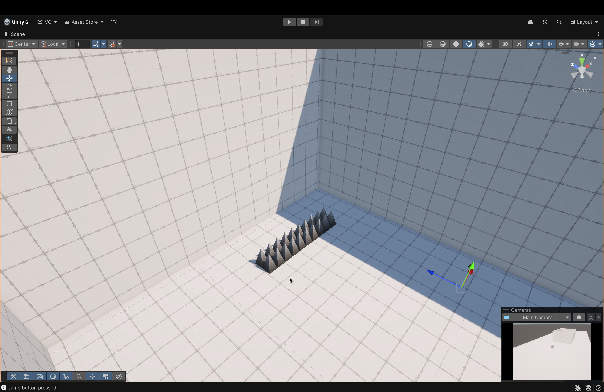

15. Now, make some copies of the **spike**:
    - Click on the modified spike asset and copy-paste it using `Ctrl`+ `C` and `Ctrl` + `V`.
        - The copy is placed within the spike asset you copied from. So, **drag** the copy out and you'll see it.
        - I would suggest having **5** spikes in total.
            - We'll be able to resize them later.
 

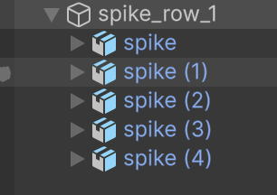

15. Let's group the copies together!
    - Inside of your **Hierarchy** (list of assets) to the left, right-click in an empty spot.
    - Find and click the **Create Empty** option.
        - This will create an **empty** asset (which we'll store our copies inside of)
    - Name the new asset **spike_row_1**
    - Now, place all of your spike assets inside of **spike_row_1**
        - You might be asking: "Why couldn't we just apply the tag and collider to this row object? Why apply it to each spike individually?"
            - Because, this newly created **spike_row_1** asset is **EMPTY**
            - It does not have a physical presence in our Scene.
            - Therefore, it is not affected by any components that we apply to it
    - In the end, your spike assets should look something like the image above.
 

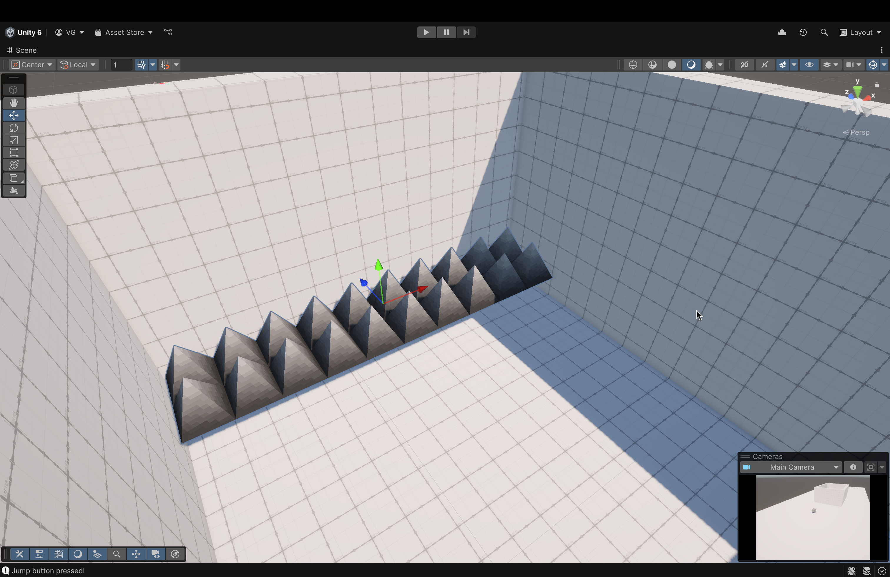

15. Select the **row** from your hierarchy to move all of your spikes at once.
    - Drag them into the pit and place them all the way in the **backend**
    - This is where you'll have to do some trial-and-error to ensure it fits properly (both vertically and horizontally)
        - Inside of your scene, in the vertical bar to the left (that has a bunch of options), select the **Scale Tool** which is the 5th option from the top
            - Your axes should have **boxes** at the end of them if you picked the right tool.
            - Use this tool to resize your row as you need to.
 

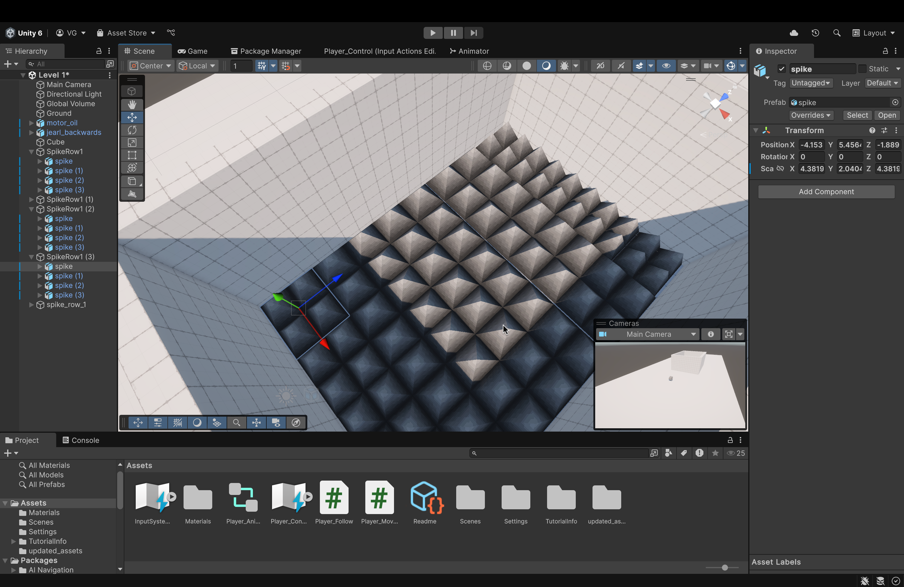

15. Now, make copies of the **row** to fill the pit with spikes.
    - Again, resize as necessary (it doesn't have to be perfect).
        - Just make sure that the entire pit is covered with spikes and that none of the assets are clipping throught the walls of the pit.
 

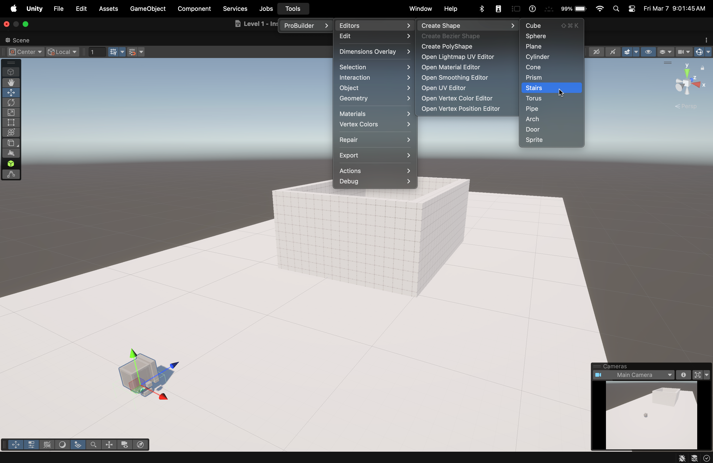

15. We will now make some stairs (you can probably tell where I'm going with this)
    - In the ProBuilder menu (up top, under Tools), hover your cursor over Editors
    - Then, hover over Create Shape
    - Now, in the next menu, click on Stairs
 

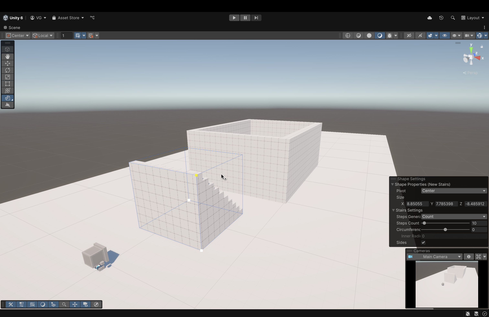

15. The creation for the stairs is the same as the Cube from earlier.
    - Create the base and then drag the cursor up to create the height of the shape.
 

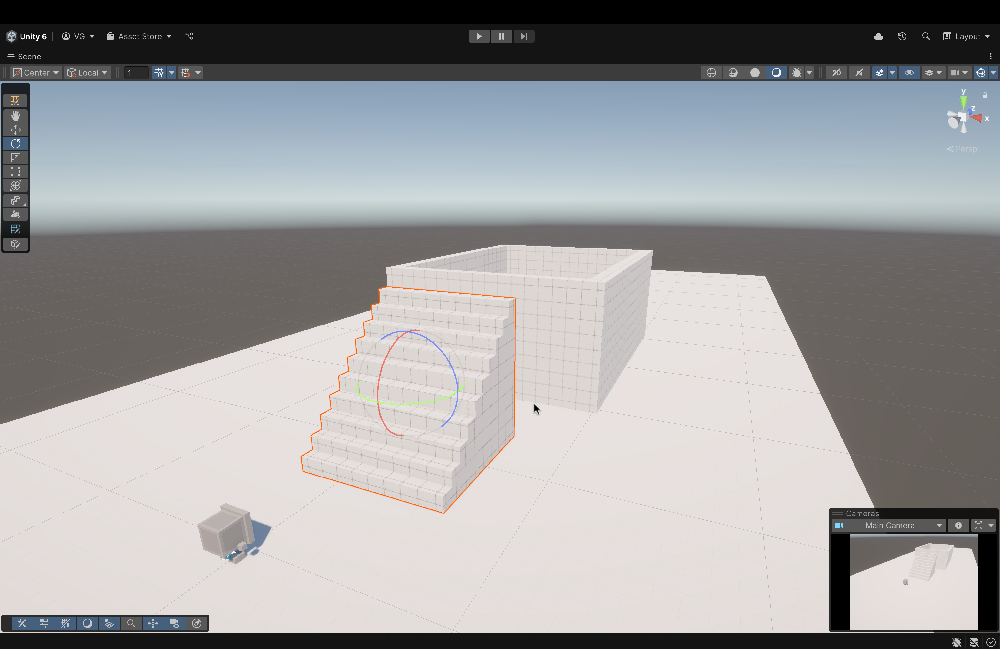

15. Try to get the height of the stairs almost level with the height of our cube (don't worry if it isn't since we'll be able to fine-tune this later)
    - Use the Rotate Tool (which is the 4th one from the top in the bar to the left in the image above) to turn the stairs around.
    - Use `Ctrl` or `Cmd` to rotate in increments (instead of freeform rotation **without** increments)
 

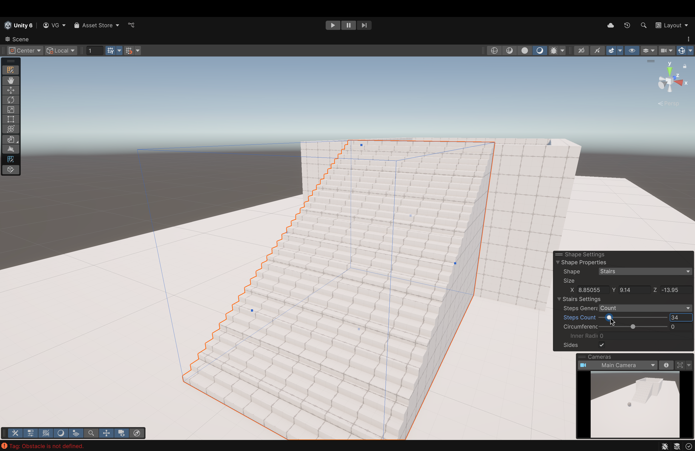

15. Using the **Shape Settings** menu of the newly created stairs.
    - Adjust its **height** and **length** and move the stairs to ensure that it is flush against the pit wall and it is **nearly** level with the wall itself
        - If it isn't perfect, don't worry. Just try to get as close as possible.
    Also, in the **Shape Settings** for the stairs, adjust the number of steps
        - We want to move up the stairs smoothly. Try using a value of around **60**.
 

#### Now, run your game, walk up the stairs, and fall into the pit. No matter what corner you land in, upon contact with the spikes, the scene should reload and you should end up back where you started from.
