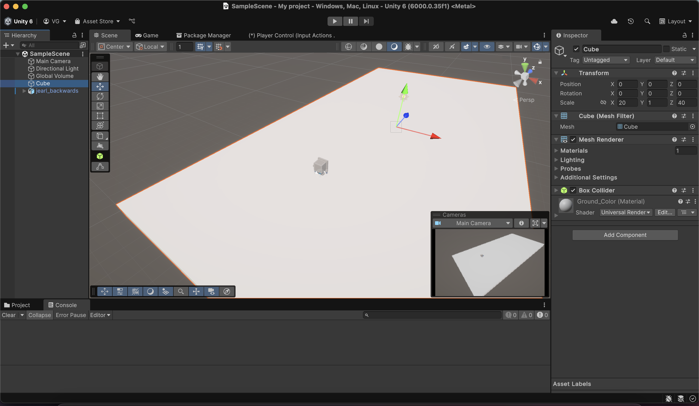

### General Layout

 

##### Counterclockwise...

* **Scene Panel**
    - This panel contains what scene you're on currently as well as all the game objects that that scene holds (ex: camera, light source, ground object, your player asset, obstacles).

* **File System**
    - This is where you can see all the files currently within your project. For our purposes, we only need to focus on the *Assets* folder and its sub-folders. In addition, you can also create your own folders to keep your project organized and functional.

* **Component Panel**
    - This is where you can see all the different components/parts of your selected game object. These could be things like transformation values (position, scale, and rotation), colliders (allow for collision), Rigidbody (for movement w/ physics) and many more...

* **Scene View**
    - This is where you can see your scene and how all of your assets physically look in your scene. There are two basic tabs here: the *Scene* tab and the *Game* tab. The *Scene* tab allows you to make whatever changes you want and the *Game* tab shows what your changes will look like during gameplay. In addition, you can press the play button at the top to start the gameplay at any time you like to test any changes that you have made.

 

### File Setup

Before we proceed, we need to make some additional changes:
- Download this tutorial's [assets.](https://drive.google.com/uc?export=download&id=1ucsgriZxbajK0LKflfUpLJHT86DQlHgI)
- Download the following Unity Packages
    - **ProBuilder** 
        - Up top, find the *Window* tab. 
        - Click to expand it.
        - Look for **Package Manager.**
        - Click on it and it will open a separate window for it.
            - Optional: You can drag the window and dock it next to the *Scene* and *Game* tabs in your Scene View.
        - In the window, on the left, click on *Unity Registry*.
        - In the search bar, start typing ProBuilder and you should see it in the search results below. 
        - On the right, in the package description, find the *Install* button and click it to install ProBuilder.
    - **Unity glTFast**
        - Follow the same steps as above to navigate to the Package Manager.
        - Now, in the corner on the left, look for a plus icon with a dropdown menu triangle next to it
            - Should look something like this:
            
        - Expand the dropdown menu and find the *Install package by name...* option
        - In the textbox, paste this name: **com.unity.cloud.gltfast**
        - Click *Install* and it will install the package and show you a package description (similar to ProBuilder)
    
#### Why do we need these packages?
- **ProBuilder** will allow us to create custom shapes and obstacles to place in our scene. Once we learn how to use it, we can let our imaginations run wild!
- **Unity glTFast** will allow us to actually use .gltf files (and the asset files in the folder you downloaded up above).

