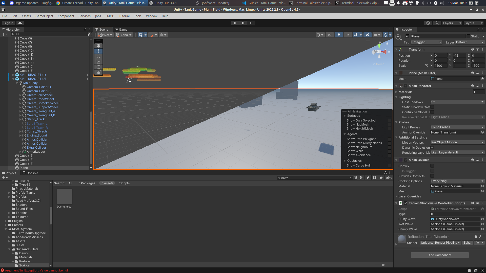

# What is Unity?

Unity is a modern, powerful game engine and editor that allows one to create fun and beautiful games using C#. Unity offers a built-in physics engine, a flexible and usable scene system, and licensing freedom as open source software. In addition, developers get access to the Unity Asset Store, which offers thousands of assets for use in your game!

[Let's get Started!](./getting-started.md)